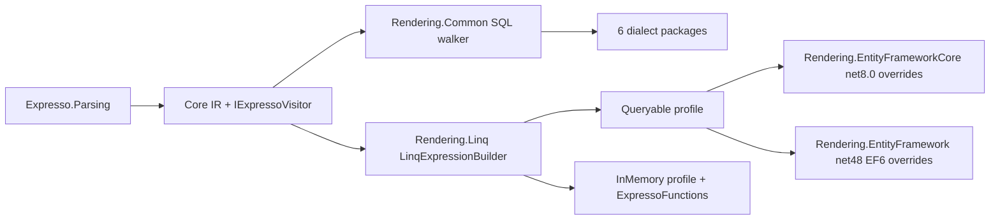

# LINQ and EF Core renderers (0.10.0)

On execution, copy this plan to `LINQRENDERERPLAN.md` in the repo root (same convention as [MULTIRENDERERPLAN.md](MULTIRENDERERPLAN.md)). Bump [Directory.Build.props](Directory.Build.props) from 0.9.0 to **0.10.0**. This is a breaking change: `AbstractExpression` gains an abstract `Accept`.

## Locked decisions

- **Parity target:** on every engine, filtering and sorting through EF Core must return exactly what the existing ADO dialect renderer returns. This covers null logic, type rules, parameterization and every function's semantics. It is proven by differential integration tests, not assumed.
- **In-memory reference semantics:** today nothing runs in memory, so there is no current behaviour to copy. The in-memory profile therefore follows **PostgreSQL** semantics, the closest engine to ANSI: NULL-propagating `concat`, trailing spaces count in `len`, empty string is not NULL, `AVG` returns a fractional result, integer `/` truncates, rounding is half away from zero, `ASC` sorts NULLs last, strings compare ordinally. This is verified by a differential test of in-memory results against the PostgreSQL ADO path.
- **Engine-defined behaviour** is recorded in `docs/semantics.md` rather than "fixed". It is the seed for your future cross-language specification. Examples: collation, SQL Server `CONCAT` treating NULL as `''`, SQL Server `AVG(int)` returning an integer, MySQL `/` returning a decimal, Oracle treating `''` as NULL, NULL sort position.
- **EF parity strategy (hybrid):** emit standard .NET methods that EF translates natively. Where the differential test shows a divergence, add a provider-specific override (a marker method plus `HasDbFunction(...).HasTranslation(...)` using the Relational API only; no references to provider packages).
- **Visitor:** a named-method visitor in Core. Every renderer implements every node, so the compiler enforces full function coverage (useful for the spec).
- **Target frameworks:** Linq targets `netstandard2.0;net6.0`, depends on `Expresso.Core` only, and must not depend on `Rendering.Common`. EF Core targets `net8.0` and references `Microsoft.EntityFrameworkCore.Relational` 8.x (EF Core 8 is the lowest version every third-party provider supports). EF6 targets `net48` (matching the NetFx sample and test targets) and references `EntityFramework` 6.5.x only, with no provider packages.
- **.NET Framework coverage:** on net48, in-memory runs through Linq and database queries run through the EF6 package; the ADO dialect renderers are unchanged. The same parity target applies to EF6: EF6 results must equal ADO results on each engine.

## Architecture



## 1. Core visitor ([src/Expresso.Core](src/Expresso.Core))

- New file `CriteriaExpressions/IExpressoVisitor.cs`:

```csharp
public interface IExpressoVisitor<in TContext, out TResult>
{
    TResult VisitField(Field node, TContext context);
    TResult VisitLiteral(Literal node, TContext context);
    TResult VisitCollectionRef(CollectionRef node, TContext context);
    TResult VisitAnd(AndFunc node, TContext context);
    // ... one named method per concrete node, 67 in total
}
```

- `AbstractExpression`: add `public abstract TResult Accept<TContext, TResult>(IExpressoVisitor<TContext, TResult> visitor, TContext context);`. Every sealed node overrides it with `visitor.VisitX(this, context)`.
- Non-IR subclasses override `Accept` to throw `NotSupportedException`: the parser's private `StringLiteral` in [src/Expresso.Parsing/ExpressionParser.cs](src/Expresso.Parsing/ExpressionParser.cs), plus the test types `MockExpressionOfType`, `DummyBooleanFunction` and the subclass in `OrFuncTests`.
- Test: a reflection check that every concrete Core node dispatches to its own `VisitX` (a recording visitor).

## 2. Move the SQL walker onto the visitor ([src/Rendering/Expresso.Rendering.Common](src/Rendering/Expresso.Rendering.Common))

- `ExpressionToSqlQueryClauseTransformerBase` implements `IExpressoVisitor<SqlRenderScope, StringBuilder>`. `SqlRenderScope` bundles `fieldToColumnMap`, the builder, `parameters`, `paramNamePrefix` and `collections`.
- `GenerateClause` shrinks to `expression.Accept(this, scope)`. The `switch` and the `TryGenerate*` chains are removed (no duplicate dispatch). Protected dialect hook signatures stay unchanged, so the dialect packages need no changes.
- Gate: all existing golden-SQL tests (847 on net6.0, 812 on net48) stay green without editing them.

## 3. `Expresso.Rendering.Linq` (new package, `src/Rendering/Expresso.Rendering.Linq`)

### Public API

```csharp
public class LinqQueryMapping<T> : LinqQueryMapping
{
    public LinqQueryMapping<T> Field<TValue>(string name, Expression<Func<T, TValue>> selector);
    public LinqQueryMapping<T> Collection<TItem>(string name,
        Expression<Func<T, IEnumerable<TItem>>> navigation, LinqQueryMapping<TItem> items);
}

public interface IExpressionToLinqTransformer
{
    Expression<Func<T, bool>> BuildPredicate<T>(FilterCriteria filter, LinqQueryMapping<T> mapping);
    IReadOnlyList<LinqSortKey> BuildSortKeys<T>(SortDirective sort, LinqQueryMapping<T> mapping);
}

public static class LinqQueryExtensions   // Where / OrderBy for IQueryable<T> and IEnumerable<T>
{
    IQueryable<T> Where<T>(this IQueryable<T> q, IExpressionToLinqTransformer t, FilterCriteria f, LinqQueryMapping<T> m);
    IQueryable<T> OrderBy<T>(this IQueryable<T> q, IExpressionToLinqTransformer t, SortDirective s, LinqQueryMapping<T> m);
    // IEnumerable<T> overloads compile the lambdas; string keys use StringComparer.Ordinal
}
```

- `LinqSortKey` holds a `LambdaExpression` key and a `SortDirection`. `OrderBy`/`ThenBy` are built through generic `Queryable`/`Enumerable` calls on the key type.
- Nested sort follows the current host pattern: `SortDirective.Nested` is resolved by path (same as `NestedSortHelper`) and applied with `OrderBy` to the child query, using the item mapping.
- Concrete transformers:
  - `QueryableExpressionToLinqTransformer` (the default).
  - `InMemoryExpressionToLinqTransformer`.
  - DI: `AddLinqExpressionTransformations()` registers the queryable transformer as the interface and the in-memory one as its concrete type.

### Builder: `LinqExpressionBuilder : IExpressoVisitor<LinqScope, LinqNode>`

Split into partials (Core, Numeric, String, DateTime, Collection), each under 300 lines.

- **Null logic identical to SQL.** SQL three-valued logic (true / false / unknown) is emulated with a pair of plain `bool` expressions per boolean node, so it works whether EF uses relational or C# null semantics, and in memory. Each boolean node compiles to a `WhenTrue` expression and a `WhenFalse` expression; anything that is neither is unknown.
  - `not`: swaps the two.
  - `and`: `WhenTrue` = AND of the operands' `WhenTrue`; `WhenFalse` = OR of their `WhenFalse`.
  - `or`: the dual of `and`.
  - Comparisons: `WhenTrue` = `a != null && b != null && op`; `WhenFalse` = `a != null && b != null && !op`.
  - `in`: OR of `eq`, so `WhenTrue` = OR of the `eq`s' `WhenTrue` and `WhenFalse` = AND of their `WhenFalse`.
  - `isnull`: never unknown.
  - The predicate body is `WhenTrue`. A boolean sort key is `WhenTrue ? 1 : 0`, matching `CASE WHEN ... THEN 1 ELSE 0 END`.
- **Collections, matching the SQL `EXISTS` forms:**
  - `any(c,p)` = `c.Any(i => WhenTrue(p))`
  - `none` = `!c.Any(i => WhenTrue(p))`
  - `all(c,p)` = `!c.Any(i => WhenFalse(p))`
  - `all` with no predicate = `true`
  - `count` = `c.Count(i => WhenTrue(p))`
  - `min`/`max`/`avg` use nullable selectors (`(T?)sel`): NULL items are ignored and an empty collection gives NULL.
  - `sum` = `c.Any(i => sel != null) ? c.Sum(i => (T?)sel) : null`, which gives NULL like SQL rather than 0 like LINQ.
- **Scalar values** are carried as `LinqNode(Expression Value, Expression? IsNull)`. A reference type or `Nullable<T>` value can be null; literals never are. Queryable profile: EF propagates NULL through translated functions natively. InMemory profile: null-guarded as `anyArgNull ? null : f(args)`.
- **Type rules:**
  - A mapped lambda must return the catalog type or its `Nullable<>`. Anything else throws `ArgumentException` naming the field and both types, so any conversion is written explicitly by the host (e.g. `b => (double)b.Price`).
  - Numeric promotion as in SQL: `byte` becomes `int`; if either side is `double`, both become `double`. This applies to arithmetic, comparisons, `in`, and scalar `min`/`max`.
  - Result type is the promoted type; `int op int` stays `int`, so `div`/`mod` truncate.
- **Parameterization matches the SQL renderer:**
  - Every `Literal` becomes a captured `ParameterBox<T>.Value` field access, in the same visit order as `AddParameter`. EF emits it as a parameter; in memory it is a plain field read.
  - Values the SQL renderer writes inline stay constants: `round` default digits `0`, and the `all` no-predicate `true`.
- **Function hooks** are `protected virtual` per function, like the SQL dialect hooks.
  - Queryable profile, using methods EF translates natively:
    - `substring` becomes `Substring(start - 1, len)`.
    - `indexof` becomes `IndexOf(string)`.
    - `left`/`right` are built from `Substring`.
    - Scalar `min`/`max` become the conditional `a < b ? a : b`.
    - `dayofweek` becomes `(int)x.DayOfWeek`.
    - The `add*` functions become `AddX`; `TimeOnly`/`TimeSpan` use `Add(TimeSpan.FromX(n))`.
    - `date`/`time` become `DateOnly.FromDateTime`/`.Date`, and `TimeOnly.FromDateTime`/`.TimeOfDay`. A string argument is only allowed when it is a literal.
  - InMemory profile: calls to `ExpressoFunctions`, a public static class holding the PostgreSQL-reference implementations:
    - `Substring`/`Left`/`Right` tolerate out-of-range positions.
    - `IndexOf`/`StartsWith`/`EndsWith`/`Contains` are ordinal.
    - `Trim` removes spaces only.
    - `Round` rounds half away from zero.
    - Time-of-day `add*` wraps at 24 hours.
    - `Concat` propagates NULL.

## 4. `Expresso.Rendering.EntityFrameworkCore` (new package, `net8.0`)

- `EfCoreExpressionToLinqTransformer : QueryableExpressionToLinqTransformer` is created for a provider name (`DbContext.Database.ProviderName`). It swaps a hook for a marker call only where that provider diverges.
- `modelBuilder.HasExpressoFunctions(Database.ProviderName)` goes in `OnModelCreating`. It registers the marker methods (`ExpressoDbFunctions.*`) through `HasDbFunction(...).HasTranslation(...)`, built with `ISqlExpressionFactory`. Their SQL is the same as the dialect renderer's.
- Initial candidate overrides, each kept only if the differential test fails without it:
  - SQL Server: `dayofweek` (the `@@DATEFIRST` formula) and `avg` over `int`.
  - MySQL/MariaDB: `div` (`/`, not `DIV`).
  - PostgreSQL: `round` (cast to `numeric`).
  - Oracle: `dayofweek` (`TO_CHAR 'D'`).
  - Any engine: LIKE escaping, if it differs.
- `IncludeSorted<T>(this IQueryable<T>, SortDirective, LinqQueryMapping<T>, transformer)`: builds filtered `Include(nav.OrderBy(...))` / `ThenInclude` for `sortfor` paths whose navigation mapping is a direct navigation property. Otherwise it throws with guidance to use a child query plus `OrderBy`.
- DI: `AddEfCoreExpressionTransformations<TContext>()` registers a scoped transformer resolved from the context's provider.

## 4b. `Expresso.Rendering.EntityFramework` (new package, EF6, `net48`)

- `Ef6ExpressionToLinqTransformer : QueryableExpressionToLinqTransformer` is created for a provider invariant name (e.g. `System.Data.SqlClient`, `Npgsql`, `MySql.Data.MySqlClient`, `System.Data.SQLite.EF6`, `Oracle.ManagedDataAccess.Client`). It overrides the hooks EF6 cannot translate, using canonical `System.Data.Entity.DbFunctions`, which is portable across EF6 providers:
  - `addyears` ... `addseconds` become `DbFunctions.AddYears(x, n)` ... `DbFunctions.AddSeconds(x, n)`.
  - `date` becomes `DbFunctions.TruncateTime(x)`.
  - `left` / `right` become `DbFunctions.Left(s, n)` / `DbFunctions.Right(s, n)`.
  - `dayofweek` becomes `DbFunctions.DiffDays(knownSunday, x) % 7`, which gives Sunday = 0 on any provider. The engine's DATEFIRST or NLS setting doesn't matter.
  - `time` and time-of-day getters and `add*` on `TimeSpan` use canonical `DbFunctions.CreateTime` / `DbFunctions.AddHours` and similar. The exact form is settled by the differential test.
- Where only a provider's built-in store function gives the same result (e.g. `sqrt`, `sign`, `power` on some providers), add per-provider marker classes whose stubs carry `[DbFunction("<provider manifest namespace>", "<FUNC>")]`. EF6 can't register raw SQL translations, so every override has to be canonical functions or built-in store functions. This limit is written down in the docs.
- Null handling: the explicit null-logic encoding means results don't depend on `UseDatabaseNullSemantics`. Parameterization: EF6 also turns the captured `ParameterBox<T>.Value` into SQL parameters.
- Nested sort: EF6 has no filtered include, so `sortfor` works only through the child query plus `OrderBy`, the same pattern the hosts use today. There is no `IncludeSorted` in this package.
- DI: `AddEf6ExpressionTransformations(string providerInvariantName)`.

### 4b.1 EF6 IT findings (net48, differential against ADO)

- **SQL Server** (`EntityFramework.SqlServer`): everything matches (catalog + differential). Overrides: `DbFunctions` adds/`TruncateTime`/`DiffDays`/`Left`/`Right`, `Edm.DayOfYear`, store `SQRT`, CASE `sign`, `CreateTime` for `time` (millisecond precision), `concat` NULL-as-empty, integer `AVG`.
- **PostgreSQL** (`EntityFramework6.Npgsql` 6.4.3 on Npgsql 6): all match except `round` (EF6 forbids the `numeric` cast; native `round(float8)` is half-even, `round(float8, int)` does not exist) and `sqrt` (the provider exposes no store functions). `dayofyear` via `DiffDays` from Jan 1, `time` via `AddMilliseconds(DiffMilliseconds)`.
- **MySQL / MariaDB** (`MySql.Data.EntityFramework` 9.7): the provider translates no canonical date arithmetic, so the overrides use manifest store functions (`ADDDATE`, `TIMESTAMP`+`SEC_TO_TIME`, `ADDTIME`, `DATE`, `MAKETIME`, `DAYOFWEEK`, `DAYOFYEAR`, `SQRT`). `addyears`/`addmonths` have no function form (MySQL needs `INTERVAL` syntax), so the transformer throws. On MySQL 8.4 (not MariaDB) any computed TIME compared with a `TimeSpan` parameter is false: MySql.Data sends `'0 11:00:00.000000'`, which MySQL only converts when compared with a column.
- **Oracle** (`Oracle.ManagedDataAccess.EntityFramework` 21.18): no `Edm.Time` (no time-of-day `TimeSpan` at all); canonical adds paste the amount expression into an `INTERVAL '…'` literal, so any parameter fails (ORA-01867); EF6's own `string.Concat` null guard emits `N''` (ORA-12704 on VARCHAR2); no `SQRT`.
- **SQLite** (`System.Data.SQLite.EF6` 1.0.119): no `Edm.Time`; no canonical date arithmetic, `TruncateTime` or `CreateTime` (emitted verbatim); `DATEPART` store function works (`dayofweek`, `dayofyear`).
- **Decision (user): exact subset, loud failures.** Unmatchable combinations throw `NotSupportedException` from the transformer: PostgreSQL `round`/`sqrt`; Oracle `add*`/`time`/`sqrt`; SQLite `add*`/`date`/`time`; MySQL/MariaDB `addyears`/`addmonths`. Oracle `concat` (EF6's own `N''`) fails in the database. The IT pins all of these as expected errors in `Ef6ProviderGaps`. The MySQL 8 TimeSpan-parameter quirk is silent (driver level), so it is skipped with its reason and documented.

## 5. Tests

- **Shared catalog:** move `RendererIntegrationCases` and the widget seed rows (as plain C# objects) from [test/Rendering/Expresso.Rendering.Integration.Test](test/Rendering/Expresso.Rendering.Integration.Test) into [test/Rendering/Expresso.Rendering.TestCases](test/Rendering/Expresso.Rendering.TestCases). DDL and ADO sessions stay in the integration-test project.
- **`Expresso.Rendering.Linq.Test`** (`net6.0;net48`, runs in CI):
  - Runs the full catalog in memory against the seed objects (filter ids, parent sort, nested sort).
  - Scenario tests for three-valued logic: `neq`/`not`/`all` over NULL `notes`, `in` with a NULL operand.
  - Type-rule errors, numeric promotion, `sum`/`min`/`avg` over empty collections, parameter-box capture order, the queryable expression shape (`ToString`).
  - Target at least 85% coverage.
- **`Expresso.Rendering.EntityFrameworkCore.Test`** (`net8.0`, runs in CI): golden SQL via `ToQueryString()` on the SQL Server and SQLite providers with no connection. Covers marker translation and `IncludeSorted`.
- **`Expresso.Rendering.EntityFramework.Test`** (`net48`, runs in the Windows CI job): golden SQL via `DbQuery.ToString()` on the SQL Server provider. A test `DbConfiguration` sets a fixed `IManifestTokenResolver`, so no connection is opened. Covers every overridden hook, and asserts that the non-overridden functions translate (no `NotSupportedException`) across the full shared catalog.
- **EF6 integration tests** (`net48`, local only, `EXPRESSO_IT=1`):
  - `WidgetEf6Context` maps the existing `widget*` tables with `Database.SetInitializer<WidgetEf6Context>(null)` (no schema creation) and the same quoting and casing as the ADO fixtures (Oracle quoted lowercase).
  - A single `ItEf6Configuration : DbConfiguration` registers every EF6 provider's services and factory, because EF6 allows one configuration per AppDomain.
  - Providers: `EntityFramework.SqlServer`, `EntityFramework6.Npgsql`, `MySql.Data.EntityFramework` (MySQL and MariaDB), `System.Data.SQLite.EF6`, `Oracle.ManagedDataAccess.EntityFramework`. No DB2: EF6 needs the IBM Data Server client, and the current net48 IT already excludes DB2.
  - Same differential rule as EF Core: EF6 = ADO = expected ids, plus the differential-only edge cases.
- **Integration tests** (local only, `EXPRESSO_IT=1`):
  - Add `net8.0` to the IT project's target frameworks. EF sessions compile for `net8.0` only.
  - `WidgetDbContext` maps `widget`, `widget_tag` and `widget_tag_meta`.
  - EF providers: SqlServer, Npgsql, Pomelo (MySQL and MariaDB), Sqlite, Oracle.EntityFrameworkCore, IBM.EntityFrameworkCore.
  - For every case and engine, assert that EF results equal the ADO results equal the expected ids.
  - Differential-only cases (EF must equal ADO; no fixed expectations) probe edges the shared catalog doesn't cover: odd-number `div`, fractional `avg`, `right` longer than the string, time-of-day wrap, NULL `concat`.
  - In-memory results are compared against the PostgreSQL ADO results on the same cases.
- Update `IntegrationCoverageMatrix.md` with EF Core, EF6 and InMemory columns.

## 6. Packaging and docs

- Add all three projects and their test projects to [Expresso.slnx](Expresso.slnx). Add `.github/harness/packages/Expresso.Rendering.Linq.yaml` (publishOrder 10, packed with Core/Parsing/Common), `Expresso.Rendering.EntityFrameworkCore.yaml` and `Expresso.Rendering.EntityFramework.yaml` (publishOrder 20, in the `publish-renderers` matrix: they depend only on Linq). The EF6 package packs on ubuntu like the rest (net48 reference assemblies; CI already packs the solution on Linux).
- CI keeps `dotnet test Expresso.slnx -f net6.0|net48`: the single-framework test projects use `TreatAsLocalProperty="TargetFramework"` (always build their own framework); the EF6 tests run on Windows only. Workflows install the .NET 8 runtime for the net8.0 EF Core tests.
- New `docs/linq-rendering.md`: mapping, profiles, EF Core setup (`HasExpressoFunctions`, `IncludeSorted`), EF6 setup (provider invariant name, no filtered include, override limits), and which package to use on .NET Framework versus .NET 8+. No per-function list here; it links to the function pages, which are the single source of truth.

### Function pages ([docs/functions/](docs/functions/README.md))

Every page under `docs/functions/**` gets three new sections after the existing **SQL rendering** section. That is all 65 pages, including `sortfor` (`FunctionPageTests` checks the four headings and their order). Written after `efcore-overrides` and `ef6-it`, so the content reflects the final overrides.

- **LINQ rendering**
  - **Queryable:** the emitted lambda shape, e.g. `eq` becomes `b => b.Title != null && b.Title == p0`. Show both `WhenTrue` and `WhenFalse` for boolean functions, plus any argument adjustment (`substring` start `- 1`, numeric promotion).
  - **In-memory:** the `ExpressoFunctions` call, when it differs from Queryable, and which PostgreSQL-reference rule it enforces (e.g. `trim` removes spaces only, `sum` over an empty collection is NULL).
- **EF Core rendering**
  - **All providers:** the native EF translation used by default.
  - **Provider overrides:** only for providers with a marker override. Name the marker (`ExpressoDbFunctions.DayOfWeek`) and give the SQL it registers, grouped by provider when the SQL matches (same grouping rule as the SQL section).
  - **Notes:** anything engine-defined, linked to `docs/semantics.md`.
- **EF6 rendering**
  - **All providers:** the default EF6 translation, either the native method or the `DbFunctions` canonical override (e.g. `adddays` becomes `DbFunctions.AddDays(x, n)`).
  - **Provider overrides:** per-provider `[DbFunction]` store-function markers, if any.
  - **Not supported:** state it explicitly if a function can't be matched exactly on an EF6 provider.
- Update the function-page template in [CONTEXT.md](CONTEXT.md) to: Description, Syntax, Category/Return type, Arguments, Validation, SQL rendering, LINQ rendering, EF Core rendering, EF6 rendering, Notes.
- Update the intro of [docs/functions/README.md](docs/functions/README.md) to mention the LINQ, EF Core and EF6 sections and link to `docs/linq-rendering.md` and `docs/semantics.md`.
- Check: a docs test (or a script run during validation) asserts that every function page contains all four rendering headings.
- New `docs/semantics.md`: three-valued logic rules, type promotion, parameterization, collection semantics, and the engine-defined list.
- Update [docs/packages.md](docs/packages.md), [docs/rendering.md](docs/rendering.md) (link only), [CONTEXT.md](CONTEXT.md) and [IMPLEMENTATION.md](IMPLEMENTATION.md).

### 6.1 Parity gaps found while writing the pages

None of these was covered by the shared catalog, which is why the IT was green. **Decisions (user):** fix EF for SQLite `contains` and Oracle `concat`; fix the SQL renderer for SQL Server `indexof`. **Status: resolved**, IT green on net6.0 / net8.0 / net48.

- **Fixes:**
  - SQL Server ADO `indexof` → `(CASE WHEN DATALENGTH(find) = 0 AND text IS NOT NULL THEN 0 ELSE CHARINDEX(find, text) - 1 END)`: NULL propagates, empty `find` is `0` like the other engines. `DATALENGTH`, not `= ''`/`LEN`, because SQL Server ignores trailing spaces there. Arguments render twice (like scalar `min`/`max`).
  - EF Core SQL Server: `ExpressoDbFunctions.IndexOf` marker with the same `CASE`. EF6 SQL Server: `DATALENGTH` store stub + conditional.
  - EF Core Oracle: `ExpressoDbFunctions.IndexOf` marker `INSTR(text, find) - 1` (the provider's `CASE WHEN find IS NULL THEN 0` turned an empty `find` into `0`; ADO gives NULL).
  - EF Core SQLite `contains`: `EF.Functions.Like(text, "%" + escaped + "%", "\")` with the ADO escaping (`\`, `%`, `_`).
  - EF6 SQLite: System.Data.SQLite translates `IndexOf` / `Contains` / `StartsWith` / `EndsWith` to case-sensitive `CHARINDEX` (empty pattern misses) and rejects `LIKE ... ESCAPE`. Overrides: `indexof` tests `find.Length == 0` (like SQL Server's `DATALENGTH`); the predicates are `pattern.Length == 0 || Lower(text).X(Lower(pattern))` (SQLite `LIKE` and `LOWER` both fold ASCII only).
  - EF Core + EF6 Oracle `concat`: `ConcatNullAsEmpty(..., nullWhenAllNull: true)`, NULL when every argument is NULL.
  - Differential cases: `contains-case`, `startswith-case`, `endswith-case`, `contains-empty`, `startswith-empty`, `endswith-empty`, `indexof-empty`, `indexof-space`, `indexof-null`, `concat-null-all`.

Findings (before the fixes):

- **SQLite `contains` (EF Core):** EF Core emits `instr(text, p) > 0` (case-sensitive); ADO emits `LIKE` (ASCII case-insensitive). `startswith`/`endswith` use `LIKE` on both. EF6 SQLite not yet checked.
- **SQL Server `indexof`:** ADO `ISNULL(NULLIF(CHARINDEX(find, text), 0), 0) - 1` returns `-1` for an empty `find` and for a NULL argument. EF Core returns `0` for an empty `find` (`CASE WHEN @p = N'' THEN 0`) and NULL for a NULL argument; EF6 returns `-1` for an empty `find` but NULL for a NULL argument. The other ADO dialects return `0` for an empty `find` (Oracle NULL) and propagate NULL.
- **Oracle `concat` (EF Core):** the NULL-as-empty lambda is never NULL, so `isnull(concat(a,b))` is false; ADO `a || b` is NULL when every operand is NULL or empty. EF6 Oracle `concat` already fails (ORA-12704).

## Risks

- DB2 and Oracle EF providers on `net8.0` (IBM clidriver, Oracle EF 8). If one can't restore or run, stop and report; don't skip it silently.
- EF Core may translate some composed BCL calls differently across providers. The differential test is the gate, and fixes go through overrides.
- EF6 can't register raw SQL translations. If a function can't be matched with canonical or built-in store functions on some EF6 provider (candidates: `time` precision, `round` on PostgreSQL), report it; don't approximate. Then either document it as unsupported for that provider or agree a fix with you.
- EF6 third-party providers (`System.Data.SQLite.EF6`, `MySql.Data.EntityFramework`, and MariaDB through the MySQL provider) are less maintained. If one can't restore or run on net48, stop and report.
- Adding `Accept` touches all 67 node files. The change is mechanical and protected by the existing tests.