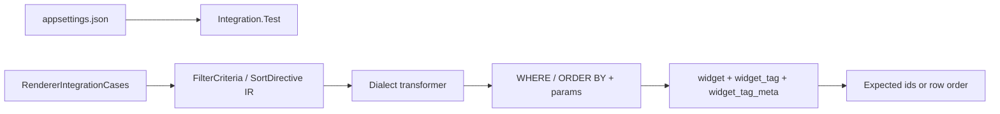

# Multi-RDBMS renderers, sample scripts, and local integration tests

Canonical plan file on execution: [MULTIRENDERERPLAN.md](MULTIRENDERERPLAN.md). Package version **0.8.0 → 0.9.0**.

**Ready to implement: yes** — architecture, IT coverage, dialect parity, and NuGet split are agreed. Remaining choices are locked below (do not re-open during execute). Implement in **todo order**; do not start a later dialect until SqlServer unit tests pass on Common.

## Locked decisions (execute as written)

- **Namespace:** public Common types (`IExpressionToQueryClauseTransformer`, `SqlQueryMapping`, `CollectionSqlMapping`, walker base) live in `Expresso.Rendering`. Dialect classes stay in the same namespace with unique names (`ExpressionToPostgreSqlQueryClauseTransformer`, …). No `TypeForwardedTo`; consumers change `using Expresso.SqlServer` → `using Expresso.Rendering`.
- **DI:** one extension per package — `AddSqlServerExpressionTransformations()`, `AddPostgreSqlExpressionTransformations()`, `AddSqliteExpressionTransformations()`, `AddMySqlExpressionTransformations()`, `AddOracleExpressionTransformations()`, `AddDb2ExpressionTransformations()`. **Remove** `AddExpressionTransformations()` (breaking).
- **Shared unit-test IR:** **`Expresso.Rendering.TestCases` is required** (not packable). Each dialect `*.Test` asserts golden SQL + params only. No `Expresso.Rendering.Common.Test` unless a walker bug cannot be shown via a dialect.
- **Harness YAML count:** **9 files** — `Expresso.Core`, `Expresso.Parsing`, `Expresso.Rendering.Common`, plus **6** dialects (SqlServer, PostgreSql, Sqlite, MySql, Oracle, Db2). MariaDB is **not** a PackageId. One publish path for every nupkg (no leftover `dotnet pack Expresso.slnx` on tag).
- **`publish.yml`:** after solution unit tests, pack/push **Core → Parsing → Common** (order), then a **matrix job** over the six dialect harness files (same `publishOrder`). Keep OIDC + `--skip-duplicate`.
- **IT when `EXPRESSO_IT=1`:** run **all** engine collections (parity). Missing Docker / bad connection **fails** that collection — no per-engine skip flags. Local workflow is `docker compose -f docker/docker-compose.it.yml up` then `EXPRESSO_IT=1`.
- **IT catalog:** `IntegrationCoverageMatrix.md` is **required**.
- **Function docs:** each function page has **SQL rendering** with dialects grouped when the SQL matches ([DOCSRENDERPLAN.md](DOCSRENDERPLAN.md)). [docs/rendering.md](docs/rendering.md) covers quotes, bind names, collection mapping, and DB2 `ORDER BY`.
- **Sample app:** remains **SQL Server only**. Portable `samples/database/` scripts are for humans; agent does not run them against live `Expresso_Sample`.
- **No decimal / float** in IT schema (not in IR). Time-of-day via `TimeSpan` (all TFMs) plus net6.0 `DateOnly`/`TimeOnly` binding in IT as already specified.

## Agreed architecture

- **`Expresso.Rendering.Common`**: `IExpressionToQueryClauseTransformer`, `SqlQueryMapping` / `CollectionSqlMapping`, shared walker (`ExpressionToSqlQueryClauseTransformerBase`). Namespace `Expresso.Rendering`. No ADO.NET.
- **Dialect packages** (`Expresso.Rendering.SqlServer`, `PostgreSql`, `Sqlite`, `MySql`, `Oracle`, `Db2`): thin subclasses, **`Expresso.Rendering.Common` + `Expresso.Core` only**, no cross-dialect refs. **Each ships as its own NuGet** (no rendering metapackage).
- **`Expresso.Rendering.Common`**: shared contract + walker — **its own NuGet**; dialect packages take a normal `PackageReference` / project reference to Common.
- **0.9.0 breaking change**: types move from `Expresso.SqlServer` to `Expresso.Rendering`.

---

## Engines in scope

| Engine | NuGet `PackageId` | Unit test project | IT catalog / user |
|---|---|---|---|
| *(shared walker)* | **`Expresso.Rendering.Common`** | *(no dedicated test project)* | — |
| SQL Server | `Expresso.Rendering.SqlServer` | `Expresso.Rendering.SqlServer.Test` (existing; migrate namespace/usings) | Database **`expresso_it`** (SA) |
| PostgreSQL | `Expresso.Rendering.PostgreSql` | `Expresso.Rendering.PostgreSql.Test` | Database + user **`expesso_it`** |
| MySQL 8 | `Expresso.Rendering.MySql` | `Expresso.Rendering.MySql.Test` | Database **`expesso_it`**, port **3306** |
| MariaDB | same **`Expresso.Rendering.MySql`** NuGet | *(same MySql.Test)* | Database **`expesso_it`**, port **3307** |
| Oracle | `Expresso.Rendering.Oracle` | `Expresso.Rendering.Oracle.Test` | User **`expesso_it`**, service **`FREEPDB1`** |
| IBM DB2 LUW | `Expresso.Rendering.Db2` | `Expresso.Rendering.Db2.Test` | Database **`expesso_it`**, user **`db2inst1`** |
| SQLite | `Expresso.Rendering.Sqlite` | `Expresso.Rendering.Sqlite.Test` | Temp file (no appsettings entry) |

**Publish harness:** one YAML per packable NuGet — **Core, Parsing, Common, plus 6 dialects = 9 files**. MariaDB has no separate NuGet or harness.

**Never** use `Expresso_Sample` for integration tests. Sample API stays SQL Server-only.

---

## 1. Common + SqlServer refactor, then dialects

Extract Common from [ExpressionToSqlServerQueryClauseTransformer](src/Rendering/Expresso.Rendering.SqlServer/ExpressionToSqlServerQueryClauseTransformer.cs); SqlServer becomes a thin subclass. New dialects override dialect hooks only.

**Walker hooks (minimum):** identifier quoting, parameter name prefix (`@` vs `:`), boolean `CASE WHEN` sort, `LIKE` escape, string length/`indexof`/`concat`, numeric `mod`/`round`/`power`, datetime extract/add/`dayofweek`, `EXISTS`/aggregate subquery aliases. Default implementations can match today’s SQL Server; dialects override what differs.

Delivery order matches todos: Common + SqlServer tests green → PostgreSQL → SQLite → MySQL → Oracle → DB2 → sample scripts → IT → harness/publish → docs.

---

## 1b. Dialect renderer unit tests (required; runs in CI)

**In addition to integration tests**, every dialect package gets a dedicated **unit test project** with **no database** — assert rendered `WHERE` / `ORDER BY` text and parameter dictionaries only.

### Scope (parity with SQL Server)

Use [test/Rendering/Expresso.Rendering.SqlServer.Test](test/Rendering/Expresso.Rendering.SqlServer.Test) as the **reference suite** after the 0.9.0 refactor (rename csproj/namespace from `Expresso.SqlServer` → `Expresso.Rendering` as needed). Each new dialect implements the **same scenarios** (same IR trees, field maps, `SqlQueryMapping` shapes) with **dialect-specific golden output**:

| Test area | Source files today (SqlServer) | Assert per dialect |
|---|---|---|
| Core filter/sort | `ExpressionToSqlServerQueryClauseTransformerTests.cs` | Quoting (`[]` vs `"` vs `` ` ``), param prefix (`@` vs `:`), `AND`/`OR`, comparisons, `IN`, `IS NULL`, nested sort keys |
| Numeric | `NumericFunctionTransformerTests.cs` | `FLOOR`/`CEILING`/`ROUND`/`POWER`/`SQRT`/arithmetic spellings |
| String | `StringFunctionTransformerTests.cs` | `LEN` vs `LENGTH`, `CHARINDEX` vs `strpos`, `CONCAT` vs `\|\|`, `LIKE` escape rules |
| DateTime | `DateTimeFunctionTransformerTests.cs` | `DATEADD` vs `+ interval`, `EXTRACT`, `CAST` to date/time types |
| Collections | `CollectionQueryTransformerTests.cs` | `EXISTS` subquery shape, correlated aliases, aggregate in filter/sort |
| Types | `NewTypesTransformerTests.cs` | `uniqueidentifier` vs `uuid`, time-of-day literals |

**Coverage bar:** at least one unit test per **renderable** function category in [docs/functions/README.md](docs/functions/README.md) **per dialect** (same bar as IT, but golden **strings** not live SQL execution). When SqlServer gains a new renderer test, add the matching case to every other dialect project in the same PR (or same epic slice).

### Project conventions

- Path: `test/Rendering/Expresso.Rendering.{Dialect}.Test/`
- TFM: **`net6.0;net48`** (same as SqlServer.Test — link [IsExternalInit.cs](src/Compatibility/IsExternalInit.cs) on net48)
- Reference only the dialect package (+ Core); **no** ADO.NET drivers in unit tests
- **CI:** included in default `dotnet test Expresso.slnx` (no `EXPRESSO_IT`)

### Reducing duplication (required)

- Shared project **`Expresso.Rendering.TestCases`**: static builders for `FilterCriteria`, `SortDirective`, `SqlQueryMapping`, shared field maps. Each dialect `*.Test` calls the builder and asserts `RenderWhereClause` / `RenderOrderByClause` against **that dialect’s** expected SQL + params.
- Golden strings stay in each `*.Test` project (inline asserts; `.txt` files only if strings become unwieldy).
- **No** `Expresso.Rendering.Common.Test` unless a walker bug cannot be reproduced through a dialect subclass.

### MariaDB

One **MySql** transformer and **one** `Expresso.Rendering.MySql.Test` suite. MariaDB differences (if any) are covered by **IT** on port 3307, not a second unit test project.

---

## 2. Expresso_Sample scripts (you run SQL; agent does not)

Portable scripts from [Expresso-database-backup-SQLServer.sql](Expresso-database-backup-SQLServer.sql) under `samples/database/` per engine (`publisher`, `author`, `book`, `book_author`, `award`). Not used by IT.

---

## 3. Integration tests (local Docker; skip in CI)

**Scope (agreed):** cover **every** Expresso filter/sort function in [docs/functions/README.md](docs/functions/README.md) and **every** collection feature used in production (nested `any`/`all`/`none`, aggregates, nested `SortDirective` / `sortfor` semantics) on real engines. Feasible — details in **Coverage goal** below; parsing and exact SQL strings remain unit-test concerns.

### Purpose

- Build **IR** in C# (no parser); render with dialect transformer; execute SQL against seeded IT tables; assert row **ids** (filter) or **id order** (sort).
- Isolated IT catalog (not books/`Expresso_Sample`).

### Coverage goal — every filter/sort function and collection feature (feasible)

**Yes, this is feasible** as the target for integration tests, with a clear split of responsibilities:

| Layer | What proves it |
|---|---|
| **Parsing / grammar** (`sortfor` paths, commas in `substring`, aliases `ceil`/`pow`, duplicate sort keys) | Existing **unit tests** in `Expresso.Parsing.Test` (IT does not parse query strings). |
| **Exact SQL text** per dialect | **Renderer unit tests** — one test project **per dialect package** (§1b); full SqlServer-parity; **CI always** |
| **SQL is valid and semantically correct on a real engine** | **Integration tests** — one shared `RendererIntegrationCases` catalog, **identical case set on every dialect**, net6.0/net48; **local opt-in only** |

IT maintains a single **`RendererIntegrationCases`** catalog (filter + sort) with **at least one executable case per function** listed in [docs/functions/README.md](docs/functions/README.md), plus feature scenarios below. **`IntegrationCoverageMatrix.md`** in the test project maps each function doc page → case id(s) (required; used to prove dialect IT parity).

### IT parity across dialects (required)

Every enabled engine runs the **same integration tests** — same case ids, same `[Theory]` / `MemberData`, same expected widget ids and nested row order. No per-dialect “subset” suites.

| Rule | Detail |
|---|---|
| **Single catalog** | `RendererIntegrationCases` defines all cases once (IR + expected results). SQL Server, PostgreSQL, MySQL, MariaDB IT collection, Oracle, DB2, and SQLite all consume **identical** `MemberData` (e.g. `FilterCases`, `ParentSortCases`, `NestedSortCases`). |
| **Shared test logic** | Prefer one abstract base or shared static runner: `RunFilterCase(engine, caseId)` — each engine fixture supplies only **transformer**, **connection**, and **parameter binding** (`@` vs `:`). No copy-paste test methods per dialect with diverging assertions. |
| **Same seed** | One canonical seed script (or C# seed builder) translated to each engine’s DDL/DML quirks; **same logical data** (ids, labels, scores, meta rows) so expected results are engine-neutral. |
| **MariaDB** | Same case catalog as MySQL; only connection string (port **3307**) differs — not a different test list. |
| **SQLite** | Same case catalog as server engines; temp file fixture only changes how the DB is created. |
| **Skips** | `[SkippableFact]` / engine-only cases are **discouraged**. If unavoidable (documented engine limitation in `docs/rendering.md`), the skip must apply to a **named case id** that is **skipped on all engines** for that scenario, or the renderer must be fixed — goal is **zero** dialect-only IT gaps. |
| **Matrix** | `IntegrationCoverageMatrix.md` lists case ids once; a column per dialect marks pass/skip — used to prove parity during implementation. |

**Filter (`WHERE`) — cover every IR function:**

- Logical: `and`, `or`, `not`
- Comparison: `eq`, `neq`, `gt`, `gte`, `lt`, `lte` (on int, double, string, datetime, guid, time-of-day, nullable `notes`)
- Membership/null: `in`, `isnull`
- Arithmetic (as operands): `abs`, `add`, `sub`, `mult`, `div`, `mod`, `floor`, `ceiling`/`ceil`, `round` (1- and 2-arg), `sign`, `power`/`pow`, `sqrt`, scalar `min`/`max`
- String predicates: `startswith`, `endswith`, `contains` (include `%` / `_` / `\` in seed data)
- String transforms in comparisons or nested expr: `substring`/`substr`, `left`, `right`, `concat`, `lower`, `upper`, `trim`, `ltrim`, `rtrim`, `replace`, `len`, `indexof`
- DateTime getters: `year` … `dayofweek`, `date`, `time`
- DateTime add: `addyears` … `addseconds` (positive and negative amount where meaningful)
- Collection quantifiers on **`tags`**: `any`, `all`, `none` (with and without predicate; empty collection edge for `all`)
- Collection aggregates on **`tags`**: `count` (with/without predicate), `min`, `max`, `sum`, `avg`
- **Nested collection filter:** `any(tags, any(tag_meta, …))` using a second-level collection (see schema below) — same pattern as `any(authors, any(awards, …))` in the sample

**Sort (`ORDER BY`) — cover every sortable IR shape:**

- Scalar fields and literals in sort keys
- Every function category above where valid as a **sort key** (transforms, getters, arithmetic, `indexof`, etc.)
- **Collection aggregates in parent sort:** e.g. `count(tags)`, `min(tags, score)` (not `any`/`all`/`none` — invalid sort keys; covered by parser unit tests only)
- **Boolean sort keys:** `CASE WHEN … THEN 1 ELSE 0 END` via a predicate expression (assert asc vs desc ordering)
- **Multi-key** `ORDER BY` (two+ items in `SortDirective.Items`)
- **Nested collection sort (feature parity with `sortfor`):** IT does **not** call `SortDirectiveParser` or the `sortfor` keyword. It builds a **`SortDirective` with `Nested`** (same tree `sortfor` would produce) and:
  - Renders `ORDER BY` with the **child** `SqlQueryMapping` (`tags` item columns)
  - Executes e.g. `SELECT widget_id, label FROM widget_tag WHERE widget_id = @w ORDER BY {clause}` and asserts **row order** (labels/scores)
  - Includes **two-level nested** sort: `Nested["tags"].Nested["tag_meta"]` when path is `tags/tag_meta`
- Empty parent `Items` with only nested sort keys (parent query has no `ORDER BY`; child query does) — mirrors sample book list + `sortfor` only

**Types in seed data (per [docs/query-syntax.md](docs/query-syntax.md)):**

- `string`, `bool`, `byte`/`int`, `double`, `decimal` column only if used in mapping (Expresso does not support `float`/`decimal` in IR — omit)
- `DateTime`, `Guid`, `TimeSpan` time-of-day (all TFMs); exercise net6.0 vs net48 literal binding where getters differ (`DateOnly`/`TimeOnly` vs `DateTime`/`TimeSpan`) using the same SQL with appropriate parameter types per TFM

**Explicitly out of IT scope (covered elsewhere):**

- `sortfor` in `filter=` (error path)
- Unknown fields, parser arity errors, `RemoveDuplicates` / `TotalSortKeyCount` HTTP 400 behavior
- `IRequestFieldsInfoProvider` / security allow-list
- Sample **host** repository load patterns (IT validates renderer + SQL, not ADO batching in `BookRepository`)

**IT schema (extended for full coverage):**

| Table | Role |
|---|---|
| `widget` | Parent entity; all scalar types for filter/sort |
| `widget_tag` | First-level collection **`tags`** (`label`, `score`, …) |
| `widget_tag_meta` | Second-level collection **`tag_meta`** on tag rows (e.g. `kind`, `value`) for nested `any` / nested `sortfor` paths |

`SqlQueryMapping` for IT mirrors the sample: `tags` with `Nested` → `tag_meta`, correlate SQL app-authored in test project only.

**Implementation approach:**

- `[Theory]` + `[MemberData(nameof(RendererIntegrationCases.FilterCases))]` — **same theories** wired from each engine’s test class/collection (parity)
- Separate theories for **parent** `ORDER BY` (widget ids) vs **nested** child `ORDER BY` (tag rows / meta rows); both shared across all dialects
- Seed sized for coverage (~15–25 widgets, varied tags/meta) — still small, fixed ids
- If one engine lacks a function (e.g. `TRIM` on old SQL Server) document in `docs/rendering.md` and use `[SkippableFact]` only as last resort — goal is full parity across all planned dialects

### Opt-in

- Default `dotnet test Expresso.slnx`: all `[Trait("Category", "Integration")]` tests **skip** (CI unchanged).
- Local: set **`EXPRESSO_IT=1`** (or `IntegrationTests:Enabled=true` in config) to run IT.
- If an engine is enabled but its connection fails → **fail** (not skip).

### Connection strings — `appsettings.json`

Project: [test/Rendering/Expresso.Rendering.Integration.Test](test/Rendering/Expresso.Rendering.Integration.Test) — **`net6.0;net48`** (same pattern as [Expresso.SqlServer.Test](test/Rendering/Expresso.Rendering.SqlServer.Test/Expresso.SqlServer.Test.csproj)).

Committed file **`appsettings.json`** with default local Docker values (per your specification):

```json
{
  "IntegrationTests": {
    "Enabled": false,
    "ConnectionStrings": {
      "PostgreSql": "Host=localhost;Port=5432;Database=expesso_it;Username=expesso_it;Password=ExpessoPassword123;",
      "Oracle": "User Id=expesso_it;Password=ExpessoPassword123;Data Source=localhost:1521/FREEPDB1;",
      "Db2": "Server=localhost:50000;Database=expesso_it;UID=db2inst1;PWD=Db2Password123;",
      "MySql": "Server=localhost;Port=3306;Database=expesso_it;User ID=root;Password=root;AllowPublicKeyRetrieval=True;SslMode=None;",
      "MariaDb": "Server=localhost;Port=3307;Database=expesso_it;User ID=root;Password=root;",
      "SqlServer": "Server=localhost,1433;Initial Catalog=expresso_it;User Id=SA;Password=P@ssw0rd1;TrustServerCertificate=true"
    }
  }
}
```

- Load via `Microsoft.Extensions.Configuration` (`ConfigurationBuilder` + `AddJsonFile("appsettings.json")`).
- Optional override: configuration env vars **`IntegrationTests__ConnectionStrings__PostgreSql`** (and siblings) win over `appsettings.json`. No `EXPRESSO_IT_<ENGINE>` skip flags.
- **SQLite**: no connection string; when `EXPRESSO_IT=1`, use a temp `.db` file path in the fixture.
- Copy **`appsettings.json`** to output (`CopyToOutputDirectory`) so both TFMs load it from the test bin directory.

### .NET Framework 4.8 integration tests

**Yes — run the same IT suite on net48**, not only net6.0.

| Why | Detail |
|---|---|
| Consumer parity | Rendering packages ship **`netstandard2.0`** for .NET Framework 4.6.1+ (sample NetFx host is **net48**). IT on net48 exercises the same dependency graph as production NetFx apps. |
| Same behavior | Shared `RendererIntegrationCases` + fixtures; no duplicate test logic — only TFM-specific project setup. |
| ADO.NET | Use net48-compatible drivers in the test project: `Microsoft.Data.SqlClient`, `Npgsql`, `MySqlConnector`, `Microsoft.Data.Sqlite`, `Oracle.ManagedDataAccess.Core` (or equivalent), `IBM.Data.DB2` — versions that support net472/net48. |
| Config | `Microsoft.Extensions.Configuration` + `Configuration.Json` (netstandard2.0) on net48; same `appsettings.json`. |
| Compatibility shim | Link [IsExternalInit.cs](src/Compatibility/IsExternalInit.cs) for net48 if needed (same as other test projects). |

**How you run locally:**

```powershell
$env:EXPRESSO_IT = "1"
dotnet test test/Rendering/Expresso.Rendering.Integration.Test -c Release -f net6.0
dotnet test test/Rendering/Expresso.Rendering.Integration.Test -c Release -f net48   # Windows; Docker DBs up
```

Each TFM run is a **full pass** over enabled engines (double DB work if you run both — acceptable for local validation).

**CI:** unchanged — integration tests **skip** on both net6.0 and net48 (no `EXPRESSO_IT` in [ci.yml](.github/workflows/ci.yml)). Windows job keeps unit tests + NetFx sample build only.

**Caveats:** net48 IT is **local/Windows-oriented** (matches existing net48 test story). If a provider misbehaves on net48 only, fix or document engine-specific skip for that TFM (last resort).

### Catalog naming (important)

| Engine | Database / catalog name |
|---|---|
| PostgreSQL, MySQL, MariaDB, Oracle user, DB2 | **`expesso_it`** |
| SQL Server | **`expresso_it`** (as specified) |

Fixtures create/drop `widget`, `widget_tag`, and `widget_tag_meta` inside that catalog only.

### Docker ports (must match connection strings)

| Service | Port |
|---|---|
| PostgreSQL | 5432 |
| MySQL | 3306 |
| MariaDB | 3307 |
| Oracle | 1521 (`FREEPDB1`) |
| DB2 | 50000 |
| SQL Server | 1433 |

[docker/docker-compose.it.yml](docker/docker-compose.it.yml) documents these; **not** run in CI.

### Isolation, seeding, and teardown

**Granularity: per engine collection (bundle), not per test.**

- One xUnit **collection** per engine (e.g. `[Collection("PostgresIT")]` + `ICollectionFixture<PostgresItDatabaseFixture>`).
- The collection fixture implements **`IAsyncLifetime`** and owns the connection (or SQLite file) for **all** tests in that collection.

**InitializeAsync (start of bundle):**

1. Connect using `appsettings.json` (or env override).
2. **Idempotent reset:** drop `widget_tag_meta`, `widget_tag`, `widget` (dependency order; engine-specific `IF EXISTS`), then `CREATE TABLE` + indexes/FKs as needed.
3. **Seed once:** run a single shared script (embedded SQL or parameterized inserts) that loads the fixed `RendererIntegrationCases` dataset (same ids/values on every engine).
4. If a prior run crashed without teardown, step 2 still yields a clean slate.

**Tests in the bundle:**

- **Read-only:** `SELECT` on `widget` (filter / parent sort) and on `widget_tag` / `widget_tag_meta` (nested sort). No DML in tests.
- Each case is independent: expected ids come from the known seed, not from prior tests.
- Shared case data is invoked via `[Theory]` + `MemberData` from `RendererIntegrationCases` (IR + expected ids).

**DisposeAsync (end of bundle):**

- **Server engines:** drop `widget_tag_meta`, `widget_tag`, `widget` (or `TRUNCATE` if drop is awkward). Do **not** `DROP DATABASE` on shared Docker catalogs (`expesso_it` / `expresso_it`).
- **SQLite:** close connection and **delete** the temp `.db` file.

**Why not seed per test?**

- Slower (N × DDL/insert) with no benefit while tests stay read-only.
- Per-test seed is reserved for future cases that mutate data (out of scope unless added later).

**Parallelism:**

- Integration assembly: **`xunit.runner.json`** with `parallelizeAssembly: false` or disable parallel for integration collections only, so two engine fixtures do not fight over the same `expesso_it` database at once.
- Tests **within** one engine collection run sequentially against the same seeded tables (xUnit default for shared `ICollectionFixture`).

**Cross-run isolation:**

- Stale data from a failed run is cleared by **InitializeAsync** drop/create/seed, not only by DisposeAsync.
- IT never touches `Expresso_Sample` or production-like catalogs.

### Lifecycle (summary)

Per-engine collection fixture: connect → drop/create tables → **seed once** → all read-only tests → teardown tables (or delete SQLite file).

Shared IR case list (`RendererIntegrationCases`) — **one catalog, N engine adapters** (transformer + ADO.NET binder); every adapter runs the full catalog.



---

## 4. NuGet publishing — one package per renderer + harness YAML

Today [publish.yml](.github/workflows/publish.yml) packs the whole solution on tag `v*`. Extend so **every rendering package** is published independently on nuget.org while keeping a **single tag** release (same version on all packages).

### Packable projects

| NuGet `PackageId` | `.csproj` | Depends on (NuGet) |
|---|---|---|
| `Expresso.Rendering.Common` | `src/Rendering/Expresso.Rendering.Common/...` | `Expresso.Core` |
| `Expresso.Rendering.SqlServer` | existing | `Expresso.Rendering.Common`, `Expresso.Core` |
| `Expresso.Rendering.PostgreSql` | new | Common, Core |
| `Expresso.Rendering.Sqlite` | new | Common, Core |
| `Expresso.Rendering.MySql` | new | Common, Core |
| `Expresso.Rendering.Oracle` | new | Common, Core |
| `Expresso.Rendering.Db2` | new | Common, Core |

Also pack **`Expresso.Core`** and **`Expresso.Parsing`** via harness YAML (same workflow). Document all IDs in [docs/packages.md](docs/packages.md).

### Harness YAML (one file per NuGet)

Add **`.github/harness/packages/<PackageId>.yaml`** for **every** packable package (Core, Parsing, Common, six dialects).

Example shape (exact schema documented in `.github/harness/README.md`):

```yaml
packageId: Expresso.Rendering.PostgreSql
project: src/Rendering/Expresso.Rendering.PostgreSql/Expresso.Rendering.PostgreSql.csproj
unitTestProject: test/Rendering/Expresso.Rendering.PostgreSql.Test/Expresso.Rendering.PostgreSql.Test.csproj
publishOrder: 20   # after Common (10); dialects parallel at same tier
```

| Harness file | `packageId` | `publishOrder` |
|---|---|---|
| `Expresso.Core.yaml` | Core | 1 |
| `Expresso.Parsing.yaml` | Parsing | 2 |
| `Expresso.Rendering.Common.yaml` | Common | 10 |
| `Expresso.Rendering.SqlServer.yaml` | SqlServer | 20 |
| `Expresso.Rendering.PostgreSql.yaml` | PostgreSql | 20 |
| `Expresso.Rendering.Sqlite.yaml` | Sqlite | 20 |
| `Expresso.Rendering.MySql.yaml` | MySql | 20 |
| `Expresso.Rendering.Oracle.yaml` | Oracle | 20 |
| `Expresso.Rendering.Db2.yaml` | Db2 | 20 |

### `publish.yml` behavior

- On `v*` tag: `dotnet test Expresso.slnx` (unit tests only; IT skipped without `EXPRESSO_IT`).
- Pack/push by `publishOrder`: **Core, then Parsing, then Common**, then a **matrix** of the six dialect harness files (order 20).
- Each entry: `dotnet pack` that `project` → push `.nupkg` / `.snupkg` (OIDC + `--skip-duplicate`).
- **CI `ci.yml`:** keep `dotnet pack Expresso.slnx` as a pack-smoke (does not push). Tag publish uses harness files only.

---

## 5. Docs and solution

- [docs/packages.md](docs/packages.md) — table of every NuGet (Core, Parsing, Common, six dialects); install examples; dialect-specific DI method names.
- New [docs/rendering.md](docs/rendering.md), IT README + **`IntegrationCoverageMatrix.md`** under [Expresso.Rendering.Integration.Test](test/Rendering/Expresso.Rendering.Integration.Test).
- [`.github/harness/README.md`](.github/harness/README.md) — harness YAML schema and how release publishing uses it.
- [CONTEXT.md](CONTEXT.md), [IMPLEMENTATION.md](IMPLEMENTATION.md), [Expresso.slnx](Expresso.slnx) — include all rendering `.csproj` and test projects.

---

## 6. Validation

```powershell
# CI-equivalent: all dialect renderer unit tests (no Docker)
dotnet test Expresso.slnx -c Release -f net6.0 --filter "Category!=Integration"
dotnet test Expresso.slnx -c Release -f net48 --filter "Category!=Integration"

# Local only: exhaustive IT across engines
$env:EXPRESSO_IT = "1"
dotnet test test/Rendering/Expresso.Rendering.Integration.Test -c Release -f net6.0
dotnet test test/Rendering/Expresso.Rendering.Integration.Test -c Release -f net48
```

Add all `Expresso.Rendering.*.Test` projects to [Expresso.slnx](Expresso.slnx). Unit tests must pass on every dialect before the epic is considered complete.

Dry-run pack per harness locally:

```powershell
dotnet pack src/Rendering/Expresso.Rendering.Common/Expresso.Rendering.Common.csproj -c Release -o artifacts
```

Do not run IT/sample SQL against live **Expresso_Sample** from the agent.

## Known implementation risks (do not block start)

- Oracle / DB2 Docker images are heavy; first `compose up` may take a long time. Document in IT README.
- net48 ADO packages (`Oracle.ManagedDataAccess` vs `.Core`, IBM DB2 client) — pick versions that restore on Windows net48 during `it-project`; if a driver cannot restore, stop and document rather than invent a skip.
- Walker file size: keep Common split like today’s SqlServer partials (stay under ~300 lines per file).
- If IT discovers a real engine gap (e.g. `TRIM` semantics), **fix the renderer** or document in `docs/rendering.md`; do not add dialect-only IT skips.
