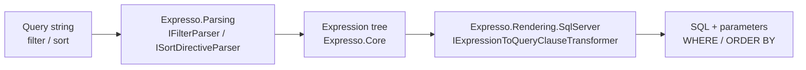

# Overview

## What Expresso is

Expresso turns a **function-call query string** — the kind of thing a client might send as `?filter=...&sort=...` — into a **validated expression tree**, then renders that tree into **parameterized SQL** for SQL Server.

```text
gt(createdAt,"2021-01-01")
```

becomes

```sql
([p].[created_at] > @wparam_0)
```

with `@wparam_0` bound to a `DateTime` parameter — never string-concatenated into the query.

It exists to replace the usual ad-hoc approach to "list" endpoints, where every optional filter/sort combination ends up as hand-written `if` statements building a `StringBuilder` of SQL, or a pile of optional LINQ `Where` clauses. Expresso gives you one small, well-tested pipeline instead:



Every node of the tree validates its own argument types when it is constructed (see [docs/error-handling.md](error-handling.md)), and every field name is checked against an allow-list you provide (see [docs/field-providers.md](field-providers.md)) — so a caller can never filter or sort on a column you did not explicitly expose.

## Use cases

- **Paginated list/search APIs** where the client picks which columns to filter and sort by (e.g. `GET /api/books?filter=...&sort=...`), without you writing a bespoke query per combination.
- **Admin / back-office grids** where the UI lets users build ad-hoc filters (date ranges, text search, status flags) against a data grid.
- **Reporting or export endpoints** that need flexible, safe predicates over a known set of columns.
- **ADO.NET / Dapper-based data-access layers** that want dynamic `WHERE` / `ORDER BY` fragments without adding an ORM or hand-rolling SQL string concatenation (and its injection risk).

## When *not* to reach for it

Expresso is intentionally narrow. It is not a replacement for:

- **OData** or similar full query protocols — no `$expand`, `$select`, pagination envelope, or standardized wire format. If you need a broad, standards-based query protocol with a large existing client ecosystem, prefer OData.
- **An ORM** — Expresso only renders `WHERE`/`ORDER BY` fragments; you still write (or generate) the base `SELECT`/joins yourself.
- **Arbitrary nested-collection queries** (e.g. `any(authors, eq(displayName,"Tolstoy"))`) — not supported in v1. See [docs/query-syntax.md](query-syntax.md) for what the grammar does support.

If your API surface is small, fixed, and known ahead of time, plain parameters might be simpler than a query language at all. Expresso is aimed at the middle ground: more filters/sort combinations than you want to hand-code, but not so open-ended that you need a full query protocol.

## Next steps

- [docs/packages.md](packages.md) — what each of the 3 NuGet packages contains
- [docs/getting-started.md](getting-started.md) — step-by-step integration guide
- [docs/functions/README.md](functions/README.md) — full function reference
- [docs/sample-app.md](sample-app.md) — a complete worked example
