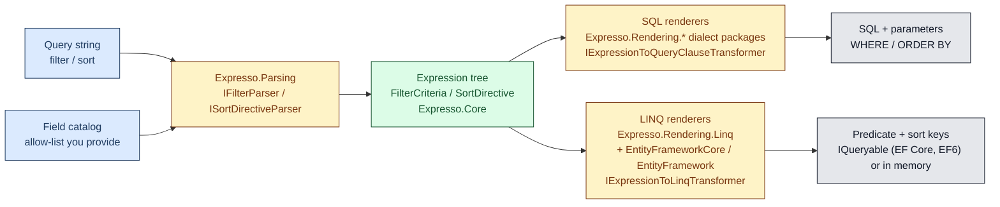

# Overview

Expresso turns the `filter` and `sort` query strings a client sends, such as `?filter=...&sort=...`, into a validated expression tree. It then renders that tree as parameterized SQL or as LINQ. Read this page to decide whether Expresso fits your application.

## How it works

A client sends a filter:

```text
gt(createdAt,"2021-01-01")
```

Expresso can render it as SQL for the dialect you choose. This table shows the output for the field map `createdAt` → `p.created_at` and the parameter prefix `wparam`:

| Dialect | Rendered filter |
|---|---|
| SQL Server | `([p].[created_at] > @wparam_0)` |
| PostgreSQL | `("p"."created_at" > @wparam_0)` |
| MySQL, MariaDB | `` (`p`.`created_at` > @wparam_0) `` |
| Oracle | `("p"."created_at" > :wparam_0)` |

Each `@wparam_0` is bound to a `DateTime` parameter. SQLite and DB2 quote identifiers like PostgreSQL.

Or it can render the filter as a LINQ lambda:

```csharp
e => e.CreatedAt > p0
```

Here `p0` is a captured value, which EF Core or EF6 binds as a SQL parameter. In both forms the value is never concatenated into the query text.

Expresso replaces the usual approach to list endpoints, where every optional filter and sort combination becomes another hand-written `if` that builds a SQL string or stacks a `Where` clause. It gives you one small pipeline instead:


```mermaid
flowchart LR
    Q["Query string<br/>filter / sort"] --> P["Expresso.Parsing<br/>IFilterParser / ISortDirectiveParser"]
    F["Field catalog<br/>allow-list you provide"] --> P
    P --> T["Expression tree<br/>FilterCriteria / SortDirective<br/>Expresso.Core"]
    T --> R["SQL renderers<br/>Expresso.Rendering.* dialect packages<br/>IExpressionToQueryClauseTransformer"]
    T --> L["LINQ renderers<br/>Expresso.Rendering.Linq<br/>+ EntityFrameworkCore / EntityFramework<br/>IExpressionToLinqTransformer"]
    R --> S["SQL + parameters<br/>WHERE / ORDER BY"]
    L --> E["Predicate + sort keys<br/>IQueryable (EF Core, EF6) or in memory"]
    style Q fill:#dbeafe,stroke:#1e3a5f,color:#1e3a5f
    style F fill:#dbeafe,stroke:#1e3a5f,color:#1e3a5f
    style P fill:#fef3c7,stroke:#78350f,color:#78350f
    style T fill:#dcfce7,stroke:#14532d,color:#14532d
    style R fill:#fef3c7,stroke:#78350f,color:#78350f
    style L fill:#fef3c7,stroke:#78350f,color:#78350f
    style S fill:#e5e7eb,stroke:#111827,color:#111827
    style E fill:#e5e7eb,stroke:#111827,color:#111827
```

Every function checks its arguments when the tree is built (see [Error handling](error-handling.md)). Every field name is checked against an allow-list you provide (see [Field providers](field-providers.md)), so a client can never filter or sort on a column you did not expose. Both renderers follow the same rules for NULL handling and types. See [Filter behavior and database differences](semantics.md).

An optional [query policy](query-policy.md) narrows the field catalog with allowed expression shapes, deny rules, and resource limits. It is compiled at startup and enforced after parsing, before either renderer receives the tree.

## Two ways to run a filter

| | SQL renderers | LINQ renderers |
|---|---|---|
| Packages | `Expresso.Rendering.SqlServer`, `PostgreSql`, `Sqlite`, `MySql`, `Oracle`, `Db2` | `Expresso.Rendering.Linq`, plus `EntityFrameworkCore` (net8.0) or `EntityFramework` (EF6, net48) |
| Output | `WHERE`, `ORDER BY`, and paging text, and parameter values | Predicates, sort keys, and result limits through `Where`, `OrderBy`, `IncludeSorted`, and `Page` extensions |
| Mapping | `SqlQueryMapping` and `CollectionSqlMapping` (field to column, collection to `FROM`) | `LinqQueryMapping<T>` (field to member lambda, collection to navigation) |
| You run it with | ADO.NET or Dapper | EF Core, EF6, any LINQ provider, or LINQ to objects |

Pick the one that matches how your application reads data. EF Core and EF6 add provider-specific translations so that results match the SQL renderer for the same database. Where EF6 cannot, it throws instead of returning a different result.

## Use cases

- Paginated list and search APIs where the client picks which columns to filter and sort by, without a bespoke query per combination.
- Admin and back-office grids where users build ad-hoc filters such as date ranges, text search and status flags.
- Reporting and export endpoints that need flexible, safe predicates over a known set of columns.
- ADO.NET and Dapper data-access layers that want dynamic `WHERE` and `ORDER BY` fragments without an ORM and without string concatenation (and its injection risk).
- EF Core and EF6 applications that want the same client-driven filtering and sorting on an `IQueryable<T>`, including `sortfor` on child collections.
- Filtering lists in memory with the same query strings you use against the database.

## When not to use Expresso

Expresso is deliberately narrow. It does not replace:

- OData or another full query protocol. There is no `$expand`, `$select`, or standard wire format. Expresso supports [paged and offset/number results](pagination.md), but your application defines how callers supply the values and how results and totals are returned. If you need a broad, standards-based protocol with an existing client ecosystem, use OData.
- An ORM. Expresso renders `WHERE` and `ORDER BY` fragments, or LINQ predicates and sort keys. You still write the base `SELECT` and joins, or supply the `IQueryable<T>`. Collection filters add correlated `EXISTS` and aggregate subqueries from your `CollectionSqlMapping`, or use the navigation in your `LinqQueryMapping<T>`. They do not load related rows for you.

If your API surface is small and fixed, plain parameters can be simpler than a query language. Expresso fits the middle ground: more filter and sort combinations than you want to code by hand, but not so open-ended that you need a full protocol.

## Next steps

- [Get started](getting-started.md): install, register, parse, then choose [SQL](getting-started-sql.md) or [LINQ and EF](getting-started-linq.md)
- [Pagination](pagination.md): paged and offset/number results
- [Packages](packages.md): the NuGet packages and which ones you need
- [LINQ rendering](linq-rendering.md): profiles, EF Core, EF6 and provider limits
- [Filter behavior and database differences](semantics.md): NULL handling, types and engine differences
- [Function reference](functions/README.md): every supported function
- [Sample app](sample-app.md): a complete worked example
