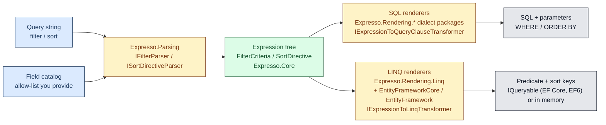

# Overview

## What Expresso is

Expresso turns a **function-call query string** — the kind of thing a client might send as `?filter=...&sort=...` — into a **validated expression tree**, then renders that tree in one of two ways:

- **Parameterized SQL** for the dialect you choose (SQL Server, PostgreSQL, SQLite, MySQL/MariaDB, Oracle, or DB2), for ADO.NET or Dapper.
- **LINQ expressions** (`Where` predicate and `OrderBy` keys) for an `IQueryable<T>` — EF Core, EF6, or another LINQ provider — or for an in-memory collection.

```text
gt(createdAt,"2021-01-01")
```

becomes, as SQL,

```sql
([p].[created_at] > @wparam_0)
```

with `@wparam_0` bound to a `DateTime` parameter, and, as LINQ,

```csharp
e => e.CreatedAt > p0
```

where `p0` is a captured parameter, which EF Core or EF6 binds as a SQL parameter. In both forms the value is never string-concatenated into the query.

It exists to replace the usual ad-hoc approach to "list" endpoints, where every optional filter/sort combination ends up as hand-written `if` statements building a `StringBuilder` of SQL, or a pile of optional LINQ `Where` clauses. Expresso gives you one small, well-tested pipeline instead:


```mermaid
flowchart LR
    Q["Query string<br/>filter / sort"] --> P["Expresso.Parsing<br/>IFilterParser / ISortDirectiveParser"]
    F["Field catalog<br/>allow-list you provide"] --> P
    P --> T["Expression tree<br/>FilterCriteria / SortDirective<br/>Expresso.Core"]
    T --> R["SQL renderers<br/>Expresso.Rendering.* dialect packages<br/>IExpressionToQueryClauseTransformer"]
    T --> L["LINQ renderers<br/>Expresso.Rendering.Linq<br/>+ EntityFrameworkCore / EntityFramework<br/>IExpressionToLinqTransformer"]
    R --> S["SQL + parameters<br/>WHERE / ORDER BY"]
    L --> E["Predicate + sort keys<br/>IQueryable (EF Core, EF6) or in memory"]
    style Q fill:#dbeafe,stroke:#1e3a5f,color:#1e3a5f
    style F fill:#dbeafe,stroke:#1e3a5f,color:#1e3a5f
    style P fill:#fef3c7,stroke:#78350f,color:#78350f
    style T fill:#dcfce7,stroke:#14532d,color:#14532d
    style R fill:#fef3c7,stroke:#78350f,color:#78350f
    style L fill:#fef3c7,stroke:#78350f,color:#78350f
    style S fill:#e5e7eb,stroke:#111827,color:#111827
    style E fill:#e5e7eb,stroke:#111827,color:#111827
```

Every node of the tree validates its own argument types when it is constructed (see [docs/error-handling.md](error-handling.md)), and every field name is checked against an allow-list you provide (see [docs/field-providers.md](field-providers.md)) — so a caller can never filter or sort on a column you did not expose. Both renderers apply the same rules for NULL handling and types; see [docs/semantics.md](semantics.md).

## Two ways to run a filter

| | SQL renderers | LINQ renderers |
|---|---|---|
| Packages | `Expresso.Rendering.SqlServer`, `PostgreSql`, `Sqlite`, `MySql`, `Oracle`, `Db2` | `Expresso.Rendering.Linq`, plus `EntityFrameworkCore` (net8.0) or `EntityFramework` (EF6, net48) |
| Output | `WHERE` / `ORDER BY` text and parameter values | `Expression<Func<T, bool>>` and sort keys; `Where` / `OrderBy` / `IncludeSorted` extensions |
| Mapping | `SqlQueryMapping`, `CollectionSqlMapping` (field to column, collection to `FROM`) | `LinqQueryMapping<T>` (field to member lambda, collection to navigation) |
| You execute with | ADO.NET, Dapper | EF Core, EF6, any LINQ provider, or LINQ to objects |

Pick the one that matches how your data access works. Setup for the LINQ side is in [docs/linq-rendering.md](linq-rendering.md). EF Core and EF6 add provider-specific translations so results match the SQL renderer for the same database. Where EF6 cannot, it throws instead of returning a different result.

## Use cases

- **Paginated list/search APIs** where the client picks which columns to filter and sort by (e.g. `GET /api/books?filter=...&sort=...`), without you writing a bespoke query per combination.
- **Admin / back-office grids** where the UI lets users build ad-hoc filters (date ranges, text search, status flags) against a data grid.
- **Reporting or export endpoints** that need flexible, safe predicates over a known set of columns.
- **ADO.NET / Dapper-based data-access layers** that want dynamic `WHERE` / `ORDER BY` fragments without adding an ORM or hand-rolling SQL string concatenation (and its injection risk).
- **EF Core or EF6 applications** that want the same client-driven filtering and sorting on an `IQueryable<T>`, including `sortfor` on child collections.
- **Filtering lists in memory** with the same query strings you use against the database.

## When *not* to reach for it

Expresso is intentionally narrow. It is not a replacement for:

- **OData** or similar full query protocols — no `$expand`, `$select`, pagination envelope, or standardized wire format. If you need a broad, standards-based query protocol with a large existing client ecosystem, prefer OData.
- **An ORM** — Expresso only renders `WHERE`/`ORDER BY` fragments or LINQ predicates and sort keys; you still write (or generate) the base `SELECT`/joins yourself, or supply the `IQueryable<T>`. Collection filters add correlated `EXISTS`/aggregate subqueries from your `CollectionSqlMapping` (or use the navigation in your `LinqQueryMapping<T>`); they do not hydrate related rows for you.

If your API surface is small, fixed, and known ahead of time, plain parameters might be simpler than a query language at all. Expresso is aimed at the middle ground: more filters/sort combinations than you want to hand-code, but not so open-ended that you need a full query protocol.

## Next steps

- [docs/packages.md](packages.md) — NuGet packages and layers
- [docs/getting-started.md](getting-started.md) — step-by-step integration guide (SQL)
- [docs/linq-rendering.md](linq-rendering.md) — LINQ, EF Core and EF6: mapping, setup, provider limits
- [docs/semantics.md](semantics.md) — NULL handling, types, and what depends on the database
- [docs/functions/README.md](functions/README.md) — full function reference
- [docs/sample-app.md](sample-app.md) — a complete worked example
