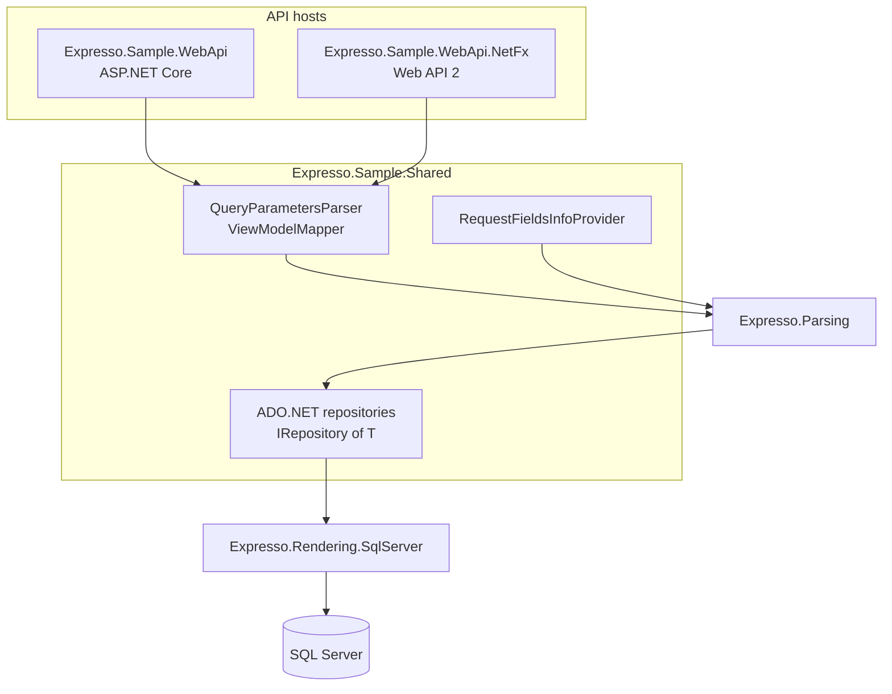

# Sample app walkthrough

Expresso ships two runnable API hosts that share the same data and filtering logic:

| Project | Host | TFM |
|---|---|---|
| [samples/Expresso.Sample.WebApi](../samples/Expresso.Sample.WebApi) | ASP.NET Core + Swagger | `net10` |
| [samples/Expresso.Sample.WebApi.NetFx](../samples/Expresso.Sample.WebApi.NetFx) | OWIN self-host + Web API 2 + Swagger | `net48` |

Shared code lives in [samples/Expresso.Sample.Shared](../samples/Expresso.Sample.Shared) (`netstandard2.0`): models, ADO.NET repositories, `RequestFieldsInfoProvider`, and `QueryParametersParser`.

For setup/run instructions, see each sample's README. This page focuses on *why* it's structured the way it is.

## Domain: books, authors, publishers

The sample database (`database/schema.sql` under the WebApi project) models a small library catalog:

| Table | Purpose |
|---|---|
| `dbo.publisher` | Publishing houses (`name`, `country`, `location`) |
| `dbo.author` | Authors (`first_name`, `last_name`, `display_name`, `date_of_birth`, `date_of_death`) |
| `dbo.book` | Books (`title`, `year`, `isbn`, `publisher_id`, `rating`, `price`, `created_at`) |
| `dbo.book_author` | Many-to-many join between `book` and `author` |

## Architecture



- **Shared layer** ([Expresso.Sample.Shared](../samples/Expresso.Sample.Shared)): domain models, view models, repositories, field catalogs, and query-parameter parsing. Each host only supplies `ISqlConnectionFactory` and thin controllers.
- **Presentation (per host):** controllers parse `filter`/`sort` via `QueryParametersParser`, guarded by `IRequestFieldsInfoProvider`. Parse failures → `400 Bad Request`.
- **Data access (shared):** repositories implement `IRepository<T>` and use `IExpressionToQueryClauseTransformer` with per-entity `fieldToColumnMap` dictionaries.

## Field catalog

[Filtering/RequestFieldsInfoProvider.cs](../samples/Expresso.Sample.Shared/Filtering/RequestFieldsInfoProvider.cs) implements `IRequestFieldsInfoProvider` with one allow-list per entity, keyed by a lower-cased `context` string (`"book"`, `"author"`, `"publisher"`). See [docs/field-providers.md](field-providers.md).

| Context | Fields |
|---|---|
| `"book"` | `title` (string), `year` (int), `isbn` (string), `publisher` (string), `price` (double), `rating` (double), `createdat` (DateTime) |
| `"author"` | `firstname`, `lastname`, `displayname` (string), `dateofbirth` (DateTime) |
| `"publisher"` | `name`, `country`, `location` (string) |

## Endpoints

| Controller | GET all | GET by id |
|---|---|---|
| Books | `GET /api/books?filter=&sort=` | `GET /api/books/{id}` |
| Authors | `GET /api/authors?filter=&sort=` | `GET /api/authors/{id}` |
| Publishers | `GET /api/publishers?filter=&sort=` | `GET /api/publishers/{id}` |

### Example queries

```text
GET /api/books?filter=gt(year,2000)&sort=rating,desc,title,asc
GET /api/books?filter=startswith(publisher,"North")
GET /api/books?filter=contains(title,"War")
GET /api/books?filter=gte(createdat,"2020-01-01")
GET /api/authors?filter=eq(firstname,"George")&sort=lastname,asc
```

## Reading further

- ASP.NET Core controller: [Controllers/BooksController.cs](../samples/Expresso.Sample.WebApi/Controllers/BooksController.cs)
- Web API 2 controller: [Controllers/BooksController.cs](../samples/Expresso.Sample.WebApi.NetFx/Controllers/BooksController.cs)
- Repository pattern: [DataAccess/BookRepository.cs](../samples/Expresso.Sample.Shared/DataAccess/BookRepository.cs)
- Grammar and functions: [docs/query-syntax.md](query-syntax.md), [docs/functions/README.md](functions/README.md)
