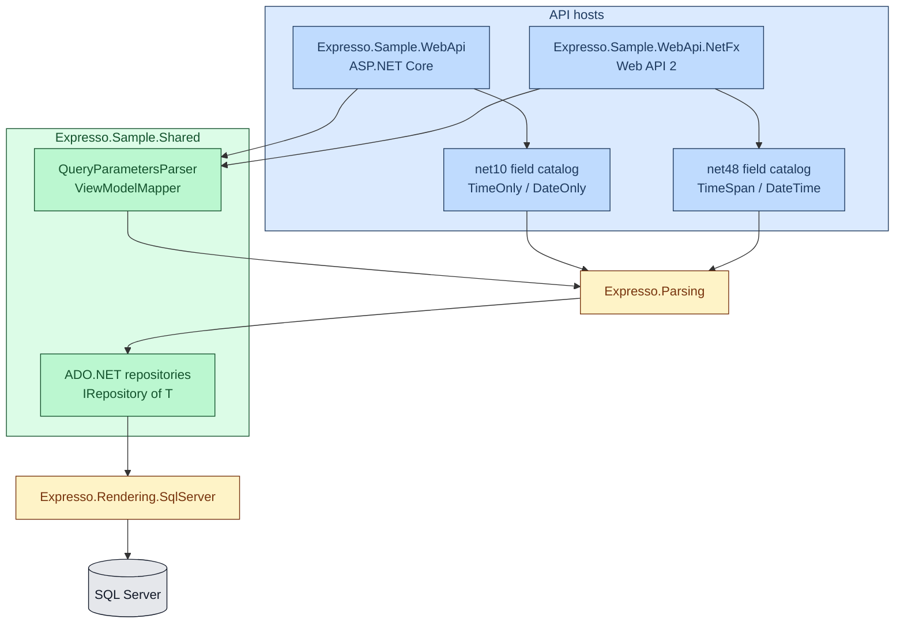

# Sample app walkthrough

Expresso ships two runnable API hosts that share the same data and filtering logic:

| Project | Host | TFM |
|---|---|---|
| [samples/Expresso.Sample.WebApi](../samples/Expresso.Sample.WebApi) | ASP.NET Core + Swagger | `net10` |
| [samples/Expresso.Sample.WebApi.NetFx](../samples/Expresso.Sample.WebApi.NetFx) | OWIN self-host + Web API 2 + Swagger | `net48` |

Shared code lives in [samples/Expresso.Sample.Shared](../samples/Expresso.Sample.Shared) (`netstandard2.0`): models, ADO.NET repositories, and `QueryParametersParser`. Each host has its own `IRequestFieldsInfoProvider` so the catalog CLR types match the Expresso TFM that host loads.

For setup/run instructions, see each sample's README. This page focuses on *why* it's structured the way it is.

## Domain: books, authors, publishers

The sample database (`database/schema.sql` under the WebApi project) models a small library catalog:

| Table | Purpose |
|---|---|
| `dbo.publisher` | Publishing houses (`name`, `country`, `location`, `opens_at`/`closes_at` TIME) |
| `dbo.author` | Authors (`first_name`, `last_name`, `display_name`, `date_of_birth`, `created_at`) |
| `dbo.book` | Books (`title`, `year`, `isbn`, `publisher_id`, `rating`, `price`, `created_at`, `external_id` UNIQUEIDENTIFIER) |
| `dbo.book_author` | Many-to-many join between `book` and `author` |
| `dbo.award` | Author awards (`title`, `year`; FK to `author`) |

## Architecture



- **Shared layer** ([Expresso.Sample.Shared](../samples/Expresso.Sample.Shared)): domain models, view models, repositories, and query-parameter parsing. Each host supplies `ISqlConnectionFactory`, thin controllers, and its own field catalog.
- **Presentation (per host):** controllers parse `filter`/`sort` via `QueryParametersParser`, guarded by that host's `IRequestFieldsInfoProvider`. Parse failures → `400 Bad Request`.
- **Data access (shared):** repositories implement `IRepository<T>` and use `IExpressionToQueryClauseTransformer` with per-entity mappings. Books use `SqlQueryMapping` with nested `authors` and `authors.awards`. Parent `ORDER BY` runs only when `SortDirective.Items` is non-empty; child lists use `SortDirective.Nested` via `sortfor`.

## Field catalog

Each host implements `IRequestFieldsInfoProvider` and `IRequestQueryModelProvider` (same query field names, different CLR types). Book context includes nested `authors` (with nested `awards` on author items). Author context includes collection `awards`. See [docs/field-providers.md](field-providers.md).

| Host | Implementation |
|---|---|
| net10 | [samples/Expresso.Sample.WebApi/Filtering/RequestFieldsInfoProvider.cs](../samples/Expresso.Sample.WebApi/Filtering/RequestFieldsInfoProvider.cs) |
| net48 | [samples/Expresso.Sample.WebApi.NetFx/Filtering/RequestFieldsInfoProvider.cs](../samples/Expresso.Sample.WebApi.NetFx/Filtering/RequestFieldsInfoProvider.cs) |

| Context | Fields | net10 CLR | net48 CLR |
|---|---|---|---|
| `"book"` | `title`, `isbn`, `publisher` | `string` | `string` |
| `"book"` | `year` | `int` | `int` |
| `"book"` | `price`, `rating` | `double` | `double` |
| `"book"` | `createdat` | `DateTime` | `DateTime` |
| `"book"` | `externalid` (**filter only**) | `Guid` | `Guid` |
| `"book"` | collection `authors` → `awards` (item fields = author / award catalogs) | — | — |
| `"author"` | `firstname`, `lastname`, `displayname` | `string` | `string` |
| `"author"` | collection `awards` (`title`, `year`) | — | — |
| `"author"` | `dateofbirth` | `DateOnly` | `DateTime` |
| `"author"` | `createdat` | `DateTime` | `DateTime` |
| `"publisher"` | `name`, `country`, `location` | `string` | `string` |
| `"publisher"` | `opens`, `closes` (SQL `time`) | `TimeOnly` | `TimeSpan` |

## Endpoints

| Controller | GET all | GET by id |
|---|---|---|
| Books | `GET /api/books?filter=&sort=` | `GET /api/books/{id}` |
| Authors | `GET /api/authors?filter=&sort=` | `GET /api/authors/{id}` |
| Publishers | `GET /api/publishers?filter=&sort=` | `GET /api/publishers/{id}` |

### Example queries

```text
GET /api/books?filter=gt(year,2000)&sort=rating,desc,title,asc
GET /api/books?filter=startswith(publisher,"North")
GET /api/books?filter=contains(title,"War")
GET /api/books?filter=gte(createdat,"2020-01-01")
GET /api/publishers?filter=eq(opens,"09:00")
GET /api/books?filter=any(authors,eq(displayname,"Leo Tolstoy"))
GET /api/books?filter=eq(count(authors),2)
GET /api/books?filter=and(gt(year,2020),any(authors,eq(displayname,"Leo Tolstoy")))
GET /api/books?filter=any(authors, any(awards, eq(title, "Nobel Prize")))
GET /api/books?sort=year,desc,sortfor(authors, lastname),asc,sortfor(authors/awards, year),desc
GET /api/authors?sort=lastname,asc,sortfor(awards, title),asc
GET /api/authors?filter=eq(firstname,"George")&sort=lastname,asc
```

On **net48**, configure `LiteralParseOptions` with `CultureName = "nl-NL"` and `DateTimeFormats = ["dd-MM-yyyy", "yyyy-MM-dd"]` if clients send European date literals (e.g. `gt(dateofbirth,"31-12-1899")`). See [docs/query-syntax.md](query-syntax.md).

## Reading further

- ASP.NET Core controller: [Controllers/BooksController.cs](../samples/Expresso.Sample.WebApi/Controllers/BooksController.cs)
- Web API 2 controller: [Controllers/BooksController.cs](../samples/Expresso.Sample.WebApi.NetFx/Controllers/BooksController.cs)
- Repository pattern: [DataAccess/BookRepository.cs](../samples/Expresso.Sample.Shared/DataAccess/BookRepository.cs)
- Grammar and functions: [docs/query-syntax.md](query-syntax.md), [docs/functions/README.md](functions/README.md)
