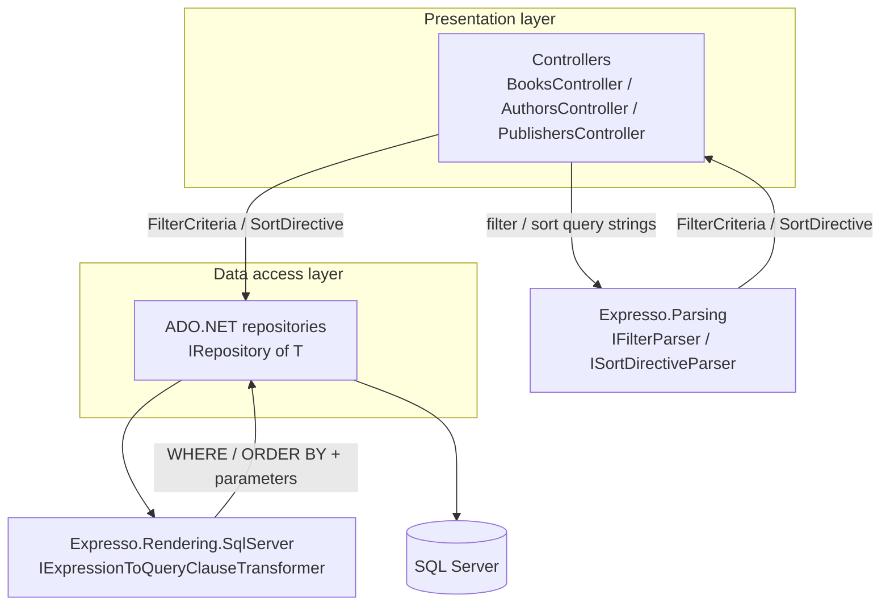

# Sample app walkthrough

[samples/Expresso.Sample.WebApi](../samples/Expresso.Sample.WebApi) is a runnable .NET 10 Web API that wires up every step from [docs/getting-started.md](getting-started.md) against a real SQL Server database. Use it as a reference implementation, or clone its patterns into your own project.

For setup/run instructions (connection string, `dotnet run`, Swagger URL), see the sample's own [README](../samples/Expresso.Sample.WebApi/README.md). This page focuses on *why* it's structured the way it is.

## Domain: books, authors, publishers

The sample database (`database/schema.sql`) models a small library catalog:

| Table | Purpose |
|---|---|
| `dbo.publisher` | Publishing houses (`name`, `country`, `location`) |
| `dbo.author` | Authors (`first_name`, `last_name`, `display_name`, `date_of_birth`, `date_of_death`) |
| `dbo.book` | Books (`title`, `year`, `isbn`, `publisher_id`, `rating`, `price`, `created_at`) |
| `dbo.book_author` | Many-to-many join between `book` and `author` |

## Two-layer architecture



- **Presentation layer** ([Controllers/](../samples/Expresso.Sample.WebApi/Controllers)): parses `filter`/`sort` query parameters using `IFilterParser`/`ISortDirectiveParser`, guarded by field catalogs from `IRequestFieldsInfoProvider`. Any parse exception (or a sort directive that lost items to `RemoveDuplicates()`) becomes a `400 Bad Request` — see [docs/error-handling.md](error-handling.md). Controllers then map domain models to view models field-by-field (no auto-mapper).
- **Data access layer** ([DataAccess/](../samples/Expresso.Sample.WebApi/DataAccess)): plain ADO.NET repositories implementing a shared `IRepository<T>` (`GetAllAsync(FilterCriteria?, SortDirective?, CancellationToken)`, `GetByIdAsync(int, CancellationToken)`). Each repository holds `IExpressionToQueryClauseTransformer` and a private, `OrdinalIgnoreCase` `fieldToColumnMap` to render `WHERE`/`ORDER BY` fragments onto a hand-written base query.

## Field catalog

[Filtering/RequestFieldsInfoProvider.cs](../samples/Expresso.Sample.WebApi/Filtering/RequestFieldsInfoProvider.cs) implements `IRequestFieldsInfoProvider` with one allow-list per entity, keyed by a lower-cased `context` string (`"book"`, `"author"`, `"publisher"`); unknown contexts return `[]`. See [docs/field-providers.md](field-providers.md) for why this shape exists.

| Context | Fields |
|---|---|
| `"book"` | `title` (string), `year` (int), `isbn` (string), `publisher` (string), `price` (double), `rating` (double), `createdat` (DateTime) |
| `"author"` | `firstname`, `lastname`, `displayname` (string), `dateofbirth` (DateTime) |
| `"publisher"` | `name`, `country`, `location` (string) |

## Endpoints

| Controller | GET all | GET by id |
|---|---|---|
| Books | `GET /api/books?filter=&sort=` | `GET /api/books/{id}` |
| Authors | `GET /api/authors?filter=&sort=` | `GET /api/authors/{id}` |
| Publishers | `GET /api/publishers?filter=&sort=` | `GET /api/publishers/{id}` |

### Example queries

```text
GET /api/books?filter=gt(year,2000)&sort=rating,desc,title,asc
GET /api/books?filter=startswith(publisher,"North")
GET /api/books?filter=contains(title,"War")
GET /api/books?filter=gte(createdat,"2020-01-01")
GET /api/authors?filter=eq(firstname,"George")&sort=lastname,asc
```

## Reading further

- The controller pattern (parse → 400 on failure → call repository) is shown in full in [Controllers/BooksController.cs](../samples/Expresso.Sample.WebApi/Controllers/BooksController.cs).
- The repository pattern (base SQL + rendered `WHERE`/`ORDER BY` + parameter binding) is shown in full in [DataAccess/BookRepository.cs](../samples/Expresso.Sample.WebApi/DataAccess/BookRepository.cs).
- For the underlying grammar and function set these queries use, see [docs/query-syntax.md](query-syntax.md) and [docs/functions/README.md](functions/README.md).
