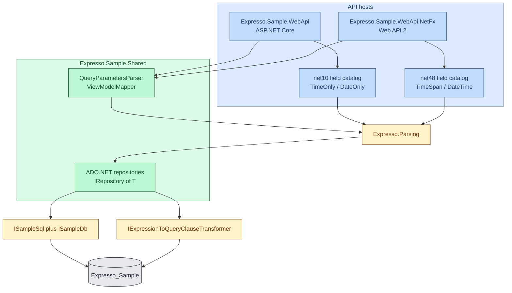

# Sample app walkthrough

The sample app is four runnable Web APIs on the same `Expresso_Sample` database: two **ADO.NET** hosts (SQL renderer → parameterized SQL) and two **EF** hosts (LINQ renderer → `IQueryable`). All use the same routes, `filter`/`sort` query strings, and `ExpressoSample:Engine` switch. This page focuses on the ADO pair; the EF pair is described in [Render to LINQ and EF](getting-started-linq.md) and each project's README.

| Project | Path | Host | TFM |
|---|---|---|---|
| ADO Core | [Expresso.Sample.WebApi](../samples/Expresso.Sample.WebApi) | ASP.NET Core + Swagger | `net10` |
| ADO net48 | [Expresso.Sample.WebApi.NetFx](../samples/Expresso.Sample.WebApi.NetFx) | OWIN + Web API 2 + Swagger | `net48` |
| EF Core | [Expresso.Sample.WebApi.EfCore](../samples/Expresso.Sample.WebApi.EfCore) | ASP.NET Core + Swagger | `net10` |
| EF6 | [Expresso.Sample.WebApi.NetFx.Ef6](../samples/Expresso.Sample.WebApi.NetFx.Ef6) | OWIN + Web API 2 + Swagger (`http://localhost:5081/`) | `net48` |

The ADO hosts share [samples/Expresso.Sample.Shared](../samples/Expresso.Sample.Shared) (`netstandard2.0`): models, ADO.NET repositories, `ISampleSql` dialect catalog, and `QueryParametersParser`. The EF hosts do **not** reference Shared; each copies its own field catalog and `QueryParametersParser`. Every host has its own `IRequestFieldsInfoProvider` so CLR types match the TFM (`DateOnly`/`TimeOnly` on net10 EF Core; `DateTime`/`TimeSpan` on net48 EF6). Schema and seed scripts are under [samples/database](../samples/database). Set `ExpressoSample:Engine` in appsettings (default SQL Server) and `ConnectionStrings:{Engine}` via user secrets (same `UserSecretsId` on all four hosts). The ADO net48 host does not register Db2; the EF6 host refuses Db2 at startup; Db2 on net10 uses [Expresso.Sample.WebApi.EfCore](../samples/Expresso.Sample.WebApi.EfCore) (EF Core) or the ADO net10 host — see [Packages](packages.md#db2-and-net-framework).

Each sample's README explains how to set up and run it. This page explains how the sample is structured and why.

## Switching the database

Set `ExpressoSample:Engine` in the host's `appsettings.json` to `SqlServer`, `PostgreSql`, `MySql`, `MariaDb`, `Sqlite`, `Oracle`, or `Db2`. `MariaDb` uses the MySQL renderer and its own database (`ConnectionStrings:MariaDb`). `Db2` is available on the net10 host only.

Put that engine's connection string in `ConnectionStrings` under the same name:

```json
{
  "ExpressoSample": {
    "Engine": "SqlServer"
  },
  "ConnectionStrings": {
    "SqlServer": "",
    "PostgreSql": "",
    "MySql": "",
    "MariaDb": "",
    "Sqlite": "",
    "Oracle": "",
    "Db2": ""
  }
}
```

## Domain: books, authors, publishers

The sample database (`samples/database/*/schema.sql`, seed from `seed.json`) models a small library catalog. Table names are shown without a schema prefix; the dialect catalog adds one where the engine needs it. The EF6 host qualifies Oracle tables with the connection's `User Id` (upper case) and PostgreSQL tables with `public`. Without that schema, those EF6 providers look for `dbo`.

| Table | Purpose |
|---|---|
| `publisher` | Publishing houses (`name`, `country`, `location`, `opens_at`/`closes_at` TIME) |
| `author` | Authors (`first_name`, `last_name`, `display_name`, `date_of_birth`, `created_at`) |
| `book` | Books (`title`, `year`, `isbn`, `publisher_id`, `rating`, `price`, `created_at`, `external_id` UNIQUEIDENTIFIER) |
| `book_author` | Many-to-many join between `book` and `author` |
| `award` | Author awards (`title`, `year`; FK to `author`) |

## Architecture


```mermaid
flowchart TD
    subgraph hosts ["API hosts"]
        CoreHost["Expresso.Sample.WebApi\nASP.NET Core"]
        NetFxHost["Expresso.Sample.WebApi.NetFx\nWeb API 2"]
        CoreFields["net10 field catalog\nTimeOnly / DateOnly"]
        NetFxFields["net48 field catalog\nTimeSpan / DateTime"]
    end
    subgraph shared ["Expresso.Sample.Shared"]
        ControllersLogic["QueryParametersParser\nViewModelMapper"]
        Repositories["ADO.NET repositories\nIRepository of T"]
    end
    CoreHost --> CoreFields
    NetFxHost --> NetFxFields
    CoreHost --> ControllersLogic
    NetFxHost --> ControllersLogic
    CoreFields --> Parsers["Expresso.Parsing"]
    NetFxFields --> Parsers
    ControllersLogic --> Parsers
    Parsers --> Repositories
    Repositories --> Catalog["ISampleSql plus ISampleDb"]
    Repositories --> Transformer["IExpressionToQueryClauseTransformer"]
    Catalog --> Db[(Expresso_Sample)]
    Transformer --> Db
    style hosts fill:#dbeafe,stroke:#1e3a5f,color:#1e3a5f
    style shared fill:#dcfce7,stroke:#14532d,color:#14532d
    style CoreHost fill:#bfdbfe,stroke:#1e3a5f,color:#1e3a5f
    style NetFxHost fill:#bfdbfe,stroke:#1e3a5f,color:#1e3a5f
    style CoreFields fill:#bfdbfe,stroke:#1e3a5f,color:#1e3a5f
    style NetFxFields fill:#bfdbfe,stroke:#1e3a5f,color:#1e3a5f
    style ControllersLogic fill:#bbf7d0,stroke:#14532d,color:#14532d
    style Repositories fill:#bbf7d0,stroke:#14532d,color:#14532d
    style Parsers fill:#fef3c7,stroke:#78350f,color:#78350f
    style Transformer fill:#fef3c7,stroke:#78350f,color:#78350f
    style Catalog fill:#fef3c7,stroke:#78350f,color:#78350f
    style Db fill:#e5e7eb,stroke:#111827,color:#111827
```

- The shared layer ([Expresso.Sample.Shared](../samples/Expresso.Sample.Shared)): domain models, view models, repositories, and query-parameter parsing. Dialect table names and bind markers are in `ISampleSql`; hosts supply `ISampleDb`, thin controllers, and a field catalog.
- In each host, the presentation layer: controllers parse `filter`/`sort` via `QueryParametersParser`, guarded by that host's `IRequestFieldsInfoProvider`. Parse failures → `400 Bad Request`.
- In the shared layer, data access: repositories implement `IRepository<T>` and use `IExpressionToQueryClauseTransformer` with per-entity mappings. Books use `SqlQueryMapping` with nested `authors` and `authors.awards`. Parent `ORDER BY` runs only when `SortDirective.Items` is non-empty; child lists use `SortDirective.Nested` via `sortfor`.
- To switch engines, `SampleEngineSetup` registers the dialect transformer and ADO.NET provider from `ExpressoSample:Engine`, and opens `ConnectionStrings:{Engine}` from user secrets. Db2 cannot `ORDER BY` a correlated collection aggregate (`count(authors)`).

## Field catalog

Each host implements `IRequestFieldsInfoProvider` and `IRequestQueryModelProvider` (same query field names, different CLR types). Book context includes nested `authors` (with nested `awards` on author items). Author context includes collection `awards`. See [Field providers](field-providers.md).

| Host | Implementation |
|---|---|
| net10 | [samples/Expresso.Sample.WebApi/Filtering/RequestFieldsInfoProvider.cs](../samples/Expresso.Sample.WebApi/Filtering/RequestFieldsInfoProvider.cs) |
| net48 | [samples/Expresso.Sample.WebApi.NetFx/Filtering/RequestFieldsInfoProvider.cs](../samples/Expresso.Sample.WebApi.NetFx/Filtering/RequestFieldsInfoProvider.cs) |

| Context | Fields | net10 CLR | net48 CLR |
|---|---|---|---|
| `"book"` | `title`, `isbn`, `publisher` | `string` | `string` |
| `"book"` | `year` | `int` | `int` |
| `"book"` | `price`, `rating` | `double` | `double` |
| `"book"` | `createdat` | `DateTime` | `DateTime` |
| `"book"` | `externalid` (**filter only**) | `Guid` | `Guid` |
| `"book"` | collection `authors` → `awards` (item fields = author / award catalogs) | — | — |
| `"author"` | `firstname`, `lastname`, `displayname` | `string` | `string` |
| `"author"` | collection `awards` (`title`, `year`) | — | — |
| `"author"` | `dateofbirth` | `DateOnly` | `DateTime` |
| `"author"` | `createdat` | `DateTime` | `DateTime` |
| `"publisher"` | `name`, `country`, `location` | `string` | `string` |
| `"publisher"` | `opens`, `closes` (SQL `time`) | `TimeOnly` | `TimeSpan` |

## Endpoints

| Controller | GET all | GET by id |
|---|---|---|
| Books | `GET /api/books?filter=&sort=&page=&pagesize=&skip=&take=` | `GET /api/books/{id}` |
| Authors | `GET /api/authors?filter=&sort=&page=&pagesize=&skip=&take=` | `GET /api/authors/{id}` |
| Publishers | `GET /api/publishers?filter=&sort=&page=&pagesize=&skip=&take=` | `GET /api/publishers/{id}` |

### Pagination contract

The sample hosts expose the two [Expresso limiting models](pagination.md) through the endpoint names below. These names and the response headers are choices made by the samples, rather than requirements of the library.

| Query parameter | Sample behavior |
|---|---|
| `page` | 1-based page number; requires `pagesize`. |
| `pagesize` | Maximum rows per page; defaults to page 1 if `page` is omitted. |
| `skip` | Number of matching rows to skip; defaults to 0. |
| `take` | Maximum rows after the offset; if omitted, return all remaining rows. |

Requests that supply `page` without `pagesize`, combine the two models, or contain invalid paging values return HTTP 400. Those input policies are stricter than the library's directive semantics.

The body always remains a JSON array. When the directive has a positive offset or a limit, the response includes `X-Total-Count`, the number of rows matching the filter before paging. Page-based requests also include `X-Total-Pages`; skip/take requests do not. These headers are present even when the result is empty. No paging headers are sent when the directive imposes no restriction, including `skip=0` without `take`.

For illustration, if 41 rows match the filter, a request beyond the last page returns:

```http
GET /api/books?page=4&pagesize=20

HTTP/1.1 200 OK
X-Total-Count: 41
X-Total-Pages: 3
Content-Type: application/json

[]
```

For the same matching count, an offset/number request beyond the end returns only the count header:

```http
GET /api/books?skip=50&take=20

HTTP/1.1 200 OK
X-Total-Count: 41
Content-Type: application/json

[]
```

If no rows match, the total count is 0 and a page-based request reports 0 total pages. Counting uses a separate query, so totals and rows can change between the reads.

### Example queries

```text
GET /api/books?filter=gt(year,2000)&sort=rating,desc,title,asc&page=2&pagesize=5
GET /api/books?skip=10&take=20
GET /api/books?filter=gt(year,2000)&sort=rating,desc,title,asc
GET /api/books?filter=startswith(publisher,"North")
GET /api/books?filter=contains(title,"War")
GET /api/books?filter=gte(createdat,"2020-01-01")
GET /api/publishers?filter=eq(opens,"09:00")
GET /api/books?filter=any(authors,eq(displayname,"Leo Tolstoy"))
GET /api/books?filter=eq(count(authors),2)
GET /api/books?filter=and(gt(year,2020),any(authors,eq(displayname,"Leo Tolstoy")))
GET /api/books?filter=any(authors, any(awards, eq(title, "Nobel Prize")))
GET /api/books?sort=year,desc,sortfor(authors, lastname),asc,sortfor(authors/awards, year),desc
GET /api/authors?sort=lastname,asc,sortfor(awards, title),asc
GET /api/authors?filter=eq(firstname,"George")&sort=lastname,asc
```

On net48, configure `LiteralParseOptions` with `CultureName = "nl-NL"` and `DateTimeFormats = ["dd-MM-yyyy", "yyyy-MM-dd"]` if clients send European date literals (for example `gt(dateofbirth,"31-12-1899")`). See [Query syntax](query-syntax.md).

## Reading further

- [Pagination](pagination.md): library semantics, provider restrictions, and counting options
- ASP.NET Core controller: [Controllers/BooksController.cs](../samples/Expresso.Sample.WebApi/Controllers/BooksController.cs)
- Web API 2 controller: [Controllers/BooksController.cs](../samples/Expresso.Sample.WebApi.NetFx/Controllers/BooksController.cs)
- Repository pattern: [DataAccess/BookRepository.cs](../samples/Expresso.Sample.Shared/DataAccess/BookRepository.cs)
- Grammar and functions: [Query syntax](query-syntax.md), [Function reference](functions/README.md)
